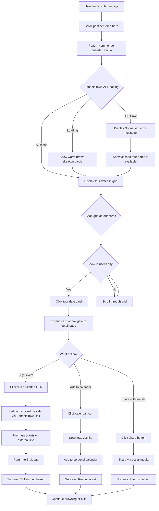
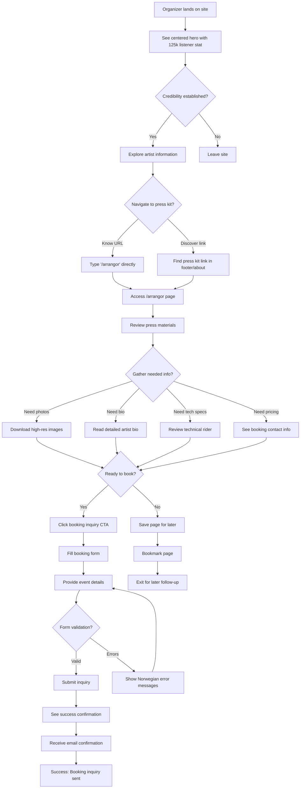
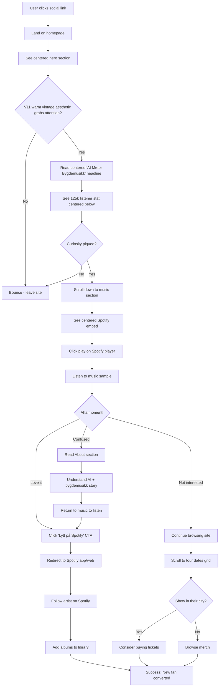
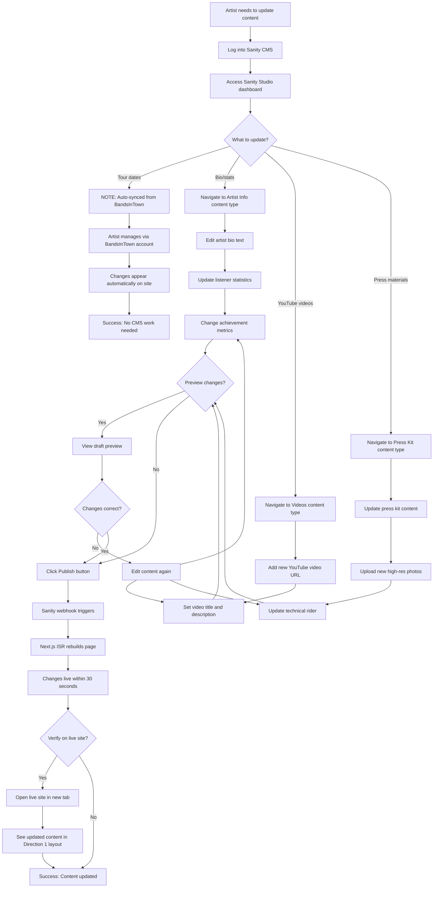

# UX Design Specification Breizaas

**Author:** Tony-
**Date:** 2025-12-21

---

<!-- UX design content will be appended sequentially through collaborative workflow steps -->

## Executive Summary

### Project Vision

Breizaas is a professional artist website that matches the legitimacy of an AI-generated Norwegian bygdemusikk artist who has already achieved 125,000 monthly Spotify listeners. This is not a proof-of-concept or experimental project - it's establishing a credible digital presence for a proven musical success story. The website bridges innovation and tradition: modern technology (AI music generation, Next.js, API integrations) serving a traditional Norwegian music genre, all while maintaining the professional standards expected of established Norwegian artists.

The primary goal is professionalization - creating a website that reflects the same professional standard as established Norwegian artists, enabling event organizers to take bookings seriously, and providing zero-friction access for fans seeking tour dates, merchandise, and artist information.

### Target Users

**Existing Fans (125,000 monthly listeners)**
- Primary need: Quick access to upcoming tour dates and merchandise
- Context: On-the-go mobile browsing between daily activities
- Success moment: Finding tour dates within seconds and purchasing merch without friction
- Technical comfort: Mixed levels, expect standard consumer web UX

**Event Organizers (Pre-Booking Evaluation)**
- Primary need: Credibility validation and complete artist information for booking decisions
- Context: Professional evaluation during work hours, primarily desktop
- Success moment: Gathering all necessary information to pitch the artist to festival boards or venue decision-makers
- Technical comfort: Professional users expecting standard web navigation

**New Audiences (Discovery Phase)**
- Primary need: Understanding what makes AI-generated bygdemusikk special
- Context: Arriving via social media links or search, mobile and desktop
- Success moment: "Aha!" moment discovering authentic-sounding AI bygdemusikk, then clicking through to Spotify
- Technical comfort: Digitally native, comfortable with modern web experiences

**Venue Staff (Post-Booking Operations)**
- Primary need: Access to technical rider, press materials, and hospitality requirements for already-booked shows
- Context: Operational planning for confirmed concerts
- Success moment: Finding all necessary production information clearly organized
- Technical comfort: Professional users needing quick access to specific documents

### Key Design Challenges

**Dual Audience Balance**
The website must simultaneously serve casual fans seeking quick information (tour dates, merch) and professional event organizers conducting thorough artist evaluations. The UX must provide instant gratification for fans while offering depth and credibility for professional decision-makers - without overwhelming either audience.

**Norwegian Authenticity vs Modern Innovation**
The design must authentically reflect Norwegian bygdemusikk tradition while showcasing the innovative AI music generation story. Visual language, typography, and interaction patterns need to feel rooted in Norwegian cultural context without appearing dated, and communicate the AI innovation without feeling gimmicky or experimental.

**Performance Under Multi-API Architecture**
Five external API integrations (Spotify, Bandsintown, Shopify, YouTube, Sanity CMS) must load seamlessly while maintaining aggressive performance targets: < 2 second page load on 3G mobile connections and Core Web Vitals compliance. The UX must gracefully handle API failures while maintaining a professional appearance.

**Operational Clarity for Post-Booking Resources**
The `/arrangor` page serves venue staff who have already booked the artist and need quick access to technical riders, press kit materials, and hospitality requirements. This page requires clear information architecture and straightforward navigation without persuasive design elements.

### Design Opportunities

**Strategic Credibility Signaling**
The 125,000 monthly listener achievement is a powerful credibility signal that can instantly overcome skepticism. Strategic placement of this metric throughout the main site (particularly on pages event organizers visit) can establish legitimacy before users even read the full artist story.

**Main Site Booking Conversion**
Since `/arrangor` serves post-booking operational needs, the Contact/About pages must carry the weight of converting curious event organizers into booking inquiries. These pages represent the primary opportunity to communicate professionalism, success metrics, and booking-readiness through UX design.

**Progressive Enhancement Architecture**
The Next.js SSG/ISR foundation enables a progressive enhancement strategy: core content and navigation accessible even with JavaScript disabled (meeting accessibility requirements), enhanced with smooth transitions and interactive elements for capable browsers. This creates an inclusive experience that performs excellently across all user contexts.

## Core User Experience

### Defining Experience

Breizaas serves multiple distinct user audiences with different core needs, each requiring a tailored yet cohesive experience:

**For Existing Fans (125k monthly listeners):**
The core experience is **instant tour date discovery**. Fans arriving on the site should find upcoming concerts within seconds, not minutes. This is followed by frictionless merchandise browsing and purchase. The experience prioritizes speed and simplicity - fans are on-the-go, browsing between activities, and need immediate answers to "when is the next show?"

**For Event Organizers (Pre-Booking Evaluation):**
The core experience is **credibility validation leading to booking inquiry**. Organizers need to quickly gather everything required to pitch Breizaas to festival boards or venue decision-makers: listener statistics, professional photos, artist background, and clear booking contact information. The experience must communicate professionalism and legitimacy at every touchpoint.

**For New Audiences (Discovery Phase):**
The core experience is **the "aha moment" of discovering AI-generated bygdemusikk**. New visitors need immediate access to music samples via Spotify embed, combined with clear explanation of what makes this unique (AI meets traditional Norwegian music). The experience should intrigue, then provide instant music access, then guide to Spotify for deeper engagement.

**For Venue Staff (Post-Booking Operations):**
The core experience is **efficient access to production materials**. Staff managing already-booked shows need quick, organized access to technical riders, press kit materials, and hospitality requirements through the `/arrangor` page. The experience prioritizes clarity and operational efficiency without persuasive design elements.

### Platform Strategy

**Primary Platform: Responsive Web Application**
Breizaas is delivered as a Next.js-based web application optimized for all devices, with a mobile-first responsive design approach.

**Device Strategy:**
- **Mobile (320px - 767px)**: Primary focus for fans seeking tour dates and merch on-the-go. Touch-optimized with minimum 44x44px tap targets, thumb-friendly navigation, and performance optimized for 3G connections.
- **Tablet (768px - 1023px)**: Balanced browsing experience supporting both casual fan browsing and professional evaluation.
- **Desktop (1024px+)**: Optimized for event organizers conducting thorough artist evaluation. Comprehensive information layout with professional presentation.

**Browser Support:**
Modern browsers only (latest Chrome, Firefox, Safari, Edge). No legacy browser support required, enabling use of current web standards and optimal performance.

**Progressive Enhancement:**
Core content and navigation accessible without JavaScript (meeting WCAG 2.1 AA requirements), enhanced with smooth transitions and interactive elements for capable browsers. This ensures inclusive access while delivering premium experiences where supported.

**Platform Capabilities Leveraged:**
- Calendar integration (tour date export)
- Social sharing with Open Graph metadata
- Norwegian locale formatting for dates/times
- Keyboard navigation and screen reader support (accessibility)

### Effortless Interactions

**Instant Tour Date Discovery**
Tour dates must be immediately visible on the homepage or accessible within a single click. No hunting through multi-level navigation. For fans, finding "when is the next show?" should take seconds, with clear venue, date, and ticket link information.

**One-Click Calendar Integration**
Adding tour dates to personal calendars should require minimal friction - ideally a single click or tap that triggers native calendar functionality across devices.

**Embedded Music Playback**
Spotify integration must load quickly and play instantly without requiring external navigation. The embedded player should feel native to the Breizaas site while providing clear path to full Spotify experience for deeper engagement.

**Credibility at First Glance**
The 125,000 monthly listener statistic should be visible immediately upon page load, establishing legitimacy before users read any detailed content. Event organizers should feel confidence within the first 3 seconds of viewing the site.

**Streamlined Booking Inquiry**
Contact and booking forms should ask only for essential information, with clear Norwegian labels, real-time validation, and immediate confirmation upon successful submission. No overwhelming field requirements or unclear error states.

**Graceful API Degradation**
When external APIs fail (Spotify, Bandsintown, Shopify), the experience must degrade gracefully with cached data fallbacks and clear Norwegian error messages. Users should never see technical error codes or broken layouts.

**Mobile Navigation Fluidity**
Navigation on mobile devices must feel native and thumb-friendly, with clear touch targets and smooth transitions. No accidentally clicking wrong menu items or struggling to reach navigation elements.

### Critical Success Moments

**Fan Success Moment: "Found it in seconds"**
Within 3 seconds of landing on the homepage, a fan should locate the next upcoming tour date and be able to add it to their calendar or click through for tickets. This instant gratification establishes Breizaas as the easiest artist site they use.

**Organizer Success Moment: "This is everything I need"**
Within a single browsing session (typically 2-5 minutes), an event organizer should gather all necessary information to pitch Breizaas to their festival board: credibility metrics (125k listeners), professional photos, artist background, and booking contact. Completing a booking inquiry form should feel professional and confidence-inspiring.

**New Audience Success Moment: "This is actually amazing"**
The discovery journey from "what is this?" to "I need to hear more" should happen seamlessly. Embedded Spotify player allows instant music sampling, the AI + bygdemusikk story creates intrigue, and clicking through to Spotify for full discography feels natural and encouraged.

**Venue Staff Success Moment: "Got what I came for"**
Accessing `/arrangor` should immediately present organized production materials. Downloading a tech rider PDF or finding hospitality requirements should take under 30 seconds with clear labels and logical organization.

**Make-or-Break Interactions:**
- Tour date loading and accuracy (outdated tour info ruins fan trust)
- Spotify embed playback (failed music playback loses new audiences immediately)
- Booking form submission success (failed submission frustrates organizers)
- Mobile navigation usability (difficult mobile UX causes abandonment)
- Page load performance (> 3 second loads cause user abandonment)

### Experience Principles

**1. Instant Access Over Deep Navigation**
Every critical user need (tour dates, music, booking info) should be accessible within 1-2 clicks from any page. Fans should find tour dates in seconds, not minutes. No burying essential information in multi-level navigation hierarchies. Surface the most important content immediately.

**2. Credibility First, Discovery Second**
The 125,000 monthly Spotify listener achievement must be immediately visible to establish legitimacy before users dig deeper. Event organizers evaluating the artist should feel confidence before they read a single paragraph of bio. Social proof precedes storytelling.

**3. Performance as User Experience**
< 2 second page loads aren't just technical requirements - they're UX requirements. API failures must degrade gracefully with cached data and Norwegian error messages. Fast is smooth, smooth is professional. Performance directly impacts perceived credibility.

**4. Mobile Momentum, Desktop Depth**
Mobile users (fans on-the-go) need speed and simplicity with thumb-friendly interactions. Desktop users (event organizers) need comprehensive information and professional presentation. Both experiences must feel native to their context, not compromised by the other.

**5. Norwegian Authenticity Throughout**
URL structure (`/musikk`, `/konserter`), content language, date formatting, error messages, and navigation labels all in Norwegian. The entire experience should feel rooted in Norwegian culture, not like a translated international template. Language choices reflect cultural authenticity.

## Desired Emotional Response

### Primary Emotional Goals

**Professional Confidence with Norwegian Authenticity**
The overarching emotional goal is to make users feel they're interacting with a legitimate, established Norwegian artist who happens to use AI technology - not an experimental tech project. This emotional foundation differs by audience but shares a core of professional credibility and cultural authenticity.

**Audience-Specific Emotional Goals:**

- **Existing Fans (125k monthly listeners)**: Effortless reliability - "This is the easiest artist site I use"
- **Event Organizers (Pre-Booking Evaluation)**: Confident credibility - "This is a legitimate, bookable artist with proven success"
- **New Audiences (Discovery Phase)**: Delighted intrigue - "AI doing bygdemusikk? This is actually amazing"
- **Venue Staff (Post-Booking Operations)**: Efficient control - "Got exactly what I needed, fast"

The emotional differentiation from typical artist websites is **professional speed + Norwegian cultural roots** - most artist sites feel either too generic/international or too amateurish. Breizaas should create confidence through professionalism, speed, and authentic Norwegian identity.

### Emotional Journey Mapping

**First Discovery**
- **Fans**: Immediate recognition + relief ("This is Breizaas's site, tour dates right here")
- **Organizers**: Immediate credibility + professional respect ("125k listeners - legitimate artist with professional presentation")
- **New Audiences**: Curiosity + intrigue ("What is AI bygdemusikk? I need to hear this")

**During Core Experience**
- **Fans**: Efficiency + satisfaction ("Found tour dates instantly, exactly as hoped")
- **Organizers**: Growing confidence ("They have everything I need - stats, photos, contact information")
- **New Audiences**: Delight + surprise ("This AI music sounds authentic and genuinely good")
- **Venue Staff**: Control + efficiency ("Clear organization, exactly what I need for production")

**After Task Completion**
- **Fans**: Accomplished + loyalty ("This site makes being a fan easy, I'll keep coming back")
- **Organizers**: Ready to act + trust ("Confident pitching this artist to my festival board")
- **New Audiences**: Excited + engaged ("Following on Spotify now, want to explore more")
- **Venue Staff**: Prepared + professional ("Got everything needed for production planning")

**When Things Go Wrong**
Users should feel **informed and reassured**, never frustrated or abandoned. API failures display cached data with clear Norwegian error messages. Form submission errors provide actionable guidance. Technical problems are communicated transparently, preserving emotional trust even during difficulties.

**Returning Users**
- **Fans**: Familiarity + trust ("I know exactly where to find what I need")
- **Organizers**: Continued confidence ("Still professional, still credible")
- **New Audiences (now fans)**: Belonging ("Part of the 125k listener community")

### Micro-Emotions

**Confidence Over Confusion**
The 125k listener statistic immediately visible on homepage establishes credibility. Clear navigation prevents confusion. Professional presentation builds organizer confidence from first glance.

**Trust Over Skepticism**
Performance reliability (< 2 second page loads) builds trust. Accurate tour date information maintains trust. Norwegian language and cultural authenticity signal legitimacy. Graceful error handling preserves trust even when APIs fail.

**Excitement (New Audiences) and Calm Efficiency (Fans/Organizers)**
New audiences should feel excitement discovering AI-generated bygdemusikk. Fans should feel calm efficiency finding information quickly. Organizers should feel professional confidence, not anxiety about booking decisions.

**Accomplishment Over Frustration**
Instant tour date discovery provides quick wins. One-click calendar integration creates effortless accomplishment. Successful booking inquiry submission delivers professional accomplishment.

**Contextual Delight and Satisfaction**
Fans experience satisfaction from reliable, efficient information access. New audiences experience delight from surprising quality of AI bygdemusikk. Organizers experience professional satisfaction from comprehensive, credible presentation.

**Belonging and Professional Connection**
Fans feel part of the 125k listener community. Organizers feel connected to the Norwegian music scene and confident representing this artist.

### Design Implications

**Confidence → Immediate Credibility Signals**
- 125k listener statistic visible in homepage hero section
- Professional photography throughout all pages
- Clear, professional typography reflecting Norwegian design sensibilities
- Fast load times (< 2s) signal technical competence and professionalism

**Trust → Performance + Accuracy + Transparency**
- Page loads under 2 seconds prevent frustration that erodes trust
- Accurate, up-to-date tour dates via Bandsintown integration
- Clear Norwegian error messages when APIs fail ("Kunne ikke laste data. Prøv igjen senere.")
- Honest, straightforward presentation of AI + bygdemusikk story

**Efficiency → Minimal Clicks, Maximum Information**
- Tour dates visible on homepage or accessible within one click
- Booking contact information clearly visible on all organizer-focused pages
- No multi-level navigation hierarchies requiring multiple clicks
- Calendar integration requiring single click/tap

**Delight → Surprising Quality + Smooth Interactions**
- Spotify embed loads and plays instantly without delays
- Smooth page transitions creating polished feel
- One-click calendar integration exceeding expectations
- Professional presentation quality that surprises positively

**Norwegian Authenticity → Language + Cultural Design Throughout**
- Norwegian URLs (`/musikk`, `/konserter`, `/om-oss`, `/kontakt`, `/arrangor`)
- Norwegian content, UI text, and navigation labels
- Norwegian date/time formatting (nb-NO locale)
- Visual design reflecting bygdemusikk cultural context, not generic international style

### Emotional Design Principles

**1. Establish Credibility Instantly**
Users (especially skeptical event organizers) should feel confidence within the first 3 seconds of viewing the site. The 125,000 monthly listener achievement serves as the emotional anchor that transforms initial skepticism into trust and legitimacy.

**2. Make Success Feel Inevitable**
Every critical user interaction should feel effortless and reliable. Fans should feel it's impossible NOT to find tour dates. Organizers should experience all booking information naturally surfacing without hunting through pages. Success should feel like the natural outcome, not a fortunate accident.

**3. Honor Norwegian Cultural Context**
The emotional response should feel rooted in Norwegian culture and bygdemusikk tradition, not like a translated international template. Language choices, visual design decisions, and interaction patterns should create a sense of cultural authenticity and belonging for Norwegian audiences.

**4. Transform Curiosity into Delight**
For new audiences discovering the artist, the emotional journey from "What is this?" to "This is amazing!" should happen seamlessly. Instant music access via Spotify embed combined with clear storytelling about AI meets bygdemusikk creates the "aha moment" that converts curiosity into engaged fandom.

**5. Preserve Trust Through Transparency**
When technical issues occur (API failures, slow connections, form errors), users should feel informed and reassured rather than abandoned or frustrated. Clear Norwegian error messages and cached data fallbacks maintain emotional trust even during technical difficulties, reinforcing that the experience is reliable and user-focused.

## UX Pattern Analysis & Inspiration

### Inspiring Products Analysis

**Luxury Casino Lounge + Dark Nightclub Aesthetic**

Breizaas draws visual and UX inspiration from the sophisticated intersection of luxury casino lounges and contemporary nightclub design - specifically avoiding gambling addiction patterns while embracing premium, atmospheric aesthetics that align perfectly with bygdemusikk party music context.

**Why This Aesthetic Works for Breizaas:**

**Party Music Visual Language**
Bygdemusikk/festmusikk is celebration and party music. Nightclub aesthetic is the natural visual language of contemporary party culture, creating immediate contextual recognition for the 125k monthly listeners who engage with this music for energy and celebration.

**AI Meets Tradition Bridge**
Dark backgrounds evoke traditional Norwegian winter nights and moody cultural atmosphere. Neon purple/pink accents signal futuristic AI innovation. This visual tension perfectly mirrors the "AI meets bygdemusikk" narrative - modern technology serving traditional genre.

**Norwegian Winter Night Sky Framing**
Purple and pink palette can be culturally framed as "Norwegian winter night sky aesthetic" (conceptually referencing aurora borealis energy without typical tourist-trap blue/green/teal colors). This provides cultural legitimacy and Norwegian authenticity to the nightclub color palette.

**Contemporary Festival/Nightclub Booker Appeal**
Event organizers and festival bookers recognize and respect this aesthetic. It signals "this artist fits contemporary nightlife and festival contexts" - not just traditional folk festivals. The visual language communicates modern relevance and commercial viability.

**Differentiation Through Sophistication**
Traditional Norwegian music sites typically use light backgrounds, earthy tones, rustic wood aesthetics. Dark + neon purple/pink creates immediate visual differentiation while maintaining sophistication and professionalism that matches 125k listener success.

**Luxury Casino UX Excellence:**

**Premium Minimalism**
- Clean, uncluttered layouts with generous white space
- Focus on essential information without visual noise
- Every element feels intentional and expensive
- Confidence through restraint - let content breathe

**Sophisticated Material Depth**
- Subtle gradients suggesting velvet, leather, polished surfaces
- Soft glows on premium elements (not harsh neon)
- Depth created through layering and shadows
- Modern flat design with sophisticated dimensional hints

**Elite Experience Without Intimidation**
- Exclusive feel while remaining accessible
- Professional presentation without corporate coldness
- Premium atmosphere without pretentiousness
- Trust the content - don't oversell

**Dark Nightclub UX Excellence:**

**Visual Hierarchy Through High Contrast**
- Dark backgrounds make white text and neon accents impossible to miss
- Critical information (tour dates, booking CTAs) stands out dramatically
- Users' eyes drawn precisely where intended through color and contrast

**Atmosphere Over Information Overload**
- Generous negative space (black space) lets content breathe
- Not cluttered - moody, atmospheric photography with dark overlays
- Focus on experience and emotion, not feature lists

**Bold, Confident Typography**
- Large, punchy headlines command attention
- High contrast ensures readability despite dark backgrounds
- Mix of elegant fonts (sophistication) with bold display fonts (energy)

**Clear CTAs That Glow**
- Buttons and links in neon accent colors are unmissable
- Hover states that intensify glow create interactive feedback
- Primary actions always visually prioritized

### Transferable UX Patterns

**Navigation Patterns for Breizaas:**

**Dark Sticky Header with Neon Accents**
- Dark charcoal/navy header remains visible during scroll
- Norwegian navigation labels in white: "Hjem", "Musikk", "Konserter", "Merch", "Om oss", "Kontakt"
- Active page indicated with champagne gold or pink underline/highlight
- Subtle gold glow on hover states
- Mobile: Hamburger menu opens full-screen dark overlay with large, neon-accented navigation links

**Minimal Top Navigation**
- 5-7 core links maximum - keeps focus on content
- `/arrangor` hidden from main nav (direct access only)
- Clean, uncluttered navigation hierarchy
- Thumb-friendly spacing on mobile (44x44px minimum tap targets)

**Interaction Patterns for Breizaas:**

**Soft Glow Hover Effects**
- Clickable elements intensify neon purple/pink glow on hover
- Subtle, elegant transitions (not harsh flash)
- Provides clear interactive feedback without overwhelming

**Smooth Scroll Animations**
- Content reveals cinematically as user scrolls
- Fade-in and subtle slide-up animations
- Creates premium, polished experience
- Performance-optimized (no janky animations)

**Neon Accent Borders on Interactive Cards**
- Tour date cards with subtle purple border
- Merch product cards with pink border on hover
- Booking form fields with gold focus states
- Creates visual consistency across interactive elements

**Dark Modals and Overlays**
- Booking form in dark modal with neon accents
- Merch quick view overlays on dark background
- Full-screen overlays for focused actions
- Maintains atmospheric consistency

**Visual Patterns for Breizaas:**

**Hero Section Strategy**
- Full-screen dark gradient background (charcoal to navy)
- Large atmospheric artist photography with subtle purple/pink color grading
- "BREIZAAS" in Tradewind font, champagne gold
- Large white headline in Norwegian
- **125k listener stat in bright neon pink** - impossible to miss, instant credibility
- Subtle Spotify embed preview below hero

**Dark Cards with Neon Borders**
- Tour dates: Dark card background (#1f1f2e), white text, purple border, gold "Kjøp billetter" CTA
- Merch products: Dark cards, clean product photography, pink hover states
- Content sections: Subtle neon dividers between major sections

**Moody Atmospheric Photography**
- Artist photos with dark, moody lighting
- Subtle purple/pink color grading overlay (10-20% opacity)
- Norwegian landscape imagery with winter night aesthetic
- Professional but atmospheric - not sterile

**Typography Hierarchy**
- Hero: Tradewind in champagne gold for "BREIZAAS" brand signature
- Primary headlines: Bold sans-serif in white or champagne gold
- Stats/numbers: Bold sans-serif in bright pink (#ff006e) - "125 000", tour counts
- Body text: Clean sans-serif in light gray (#e8e8e8) for maximum readability
- CTAs: Bold sans-serif in gold (professional booking) or pink (fan tickets)
- Navigation: Medium sans-serif in white, gold on hover

**Content Patterns for Breizaas:**

**Generous Negative Space**
- Large hero images with 70-80% dark overlay
- Content sections with ample padding and margin
- Let key information breathe - no cramming
- Premium feel through restraint

**Strategic Color Accents**
- Purple/pink used sparingly for maximum impact
- Gold highlights on premium elements
- White/gray for 90% of text content
- Spotify green for music-specific CTAs

**Layered Depth Through Shadows**
- Subtle purple-tinted shadows create depth
- Cards slightly elevated from background
- Modern flat design with sophisticated dimensional hints
- No harsh drop shadows - soft, atmospheric depth

### Anti-Patterns to Avoid

**Color Anti-Patterns:**

**Typical Northern Lights Tourist Aesthetic**
- ❌ Blue/green/teal aurora colors - feels like tourist trap merchandise
- ✅ Purple/pink framed conceptually as Norwegian winter night sky, not literal aurora visualization
- ✅ Cultural framing without visual cliché

**Gambling Addiction Color Triggers**
- ❌ Red, orange, yellow slot machine colors
- ❌ Flashy, aggressive color combinations designed to trigger compulsive behavior
- ✅ Sophisticated purple/pink/gold palette signals luxury and energy, not manipulation

**Cheap or Brassy Gold**
- ❌ Bright yellow-gold (#ffd700) looks cheap and dated
- ✅ Champagne gold (#d4af37, #f4e4c1) subtle, refined, premium
- ✅ Use gold sparingly as accent, not everywhere

**Pure Black Harshness**
- ❌ Pure black (#000000) backgrounds are harsh on eyes
- ✅ Lifted dark charcoal (#0f0f1a) or navy (#1a1a2e) feels premium and easier to read
- ✅ Slightly elevated blacks create sophisticated depth

**Design Anti-Patterns:**

**Neon Overload**
- ❌ Every element glowing creates visual chaos and fatigue
- ✅ Strategic neon accents on CTAs, stats (125k), interactive elements only
- ✅ 90% white/gray text, 10% neon accents for impact

**Low Contrast Sacrificing Accessibility**
- ❌ Dark gray text on black backgrounds
- ❌ Thin font weights that disappear on dark
- ✅ White (#ffffff) or very light gray (#e8e8e8+) for all body text
- ✅ Test all color combinations for WCAG 2.1 AA compliance (4.5:1 minimum contrast)

**Cluttered Casino Slot Machine Aesthetic**
- ❌ Every inch of screen filled with content and CTAs
- ✅ Generous white (black) space - let premium content breathe
- ✅ Minimal layouts that trust the content

**Generic Nightclub Sleaze**
- ❌ Overly suggestive imagery or copy
- ✅ Sophisticated, atmospheric aesthetic focused on music and energy
- ✅ Professional enough for event organizers evaluating booking

**Script Font Misuse**
- ❌ Tradewind for body text, navigation, or small text (illegible)
- ✅ Tradewind for "BREIZAAS" brand signature and special accent moments only
- ✅ Clean sans-serif for UI, navigation, body text
- ✅ Verify Tradewind supports Norwegian characters (æ, ø, å)

**Content Anti-Patterns:**

**Any Gambling/Betting References**
- ❌ Borrowing casino language or patterns that suggest gambling
- ✅ Luxury atmosphere only - no gaming mechanics or metaphors

**Tourist-Trap Norwegian Clichés**
- ❌ Literal northern lights imagery (blue/green gradients)
- ❌ Vikings, trolls, fjords as visual motifs
- ✅ Authentic Norwegian cultural context through language and subtle framing
- ✅ Modern Norwegian identity, not tourist stereotypes

**Over-Explaining AI Technology**
- ❌ Technical details about AI music generation overwhelming the experience
- ✅ Brief, intriguing mention of AI meets bygdemusikk
- ✅ Let the music and 125k listener success speak for themselves

### Design Inspiration Strategy

**What to Adopt (Directly Apply):**

**Dark Background Foundation**
- Deep charcoal (#0f0f1a) or navy (#1a1a2e) as primary background
- Creates premium, atmospheric canvas for content
- High contrast makes key information pop
- Differentiates from typical light Norwegian music sites

**Purple/Pink Neon Accent System**
- Bright pink (#ff006e, #ff1493) for stats, energetic CTAs, hover states
- Purple (#c77dff, #e539ff) for interactive elements, card borders
- Strategic use only - 10% of visual elements
- **125k listener stat in neon pink** - instant credibility and impossible to miss

**Champagne Gold Premium Touches**
- Champagne gold (#d4af37, #f4e4c1) for premium CTAs, brand signature, accent headings
- Suggests luxury without cheap brassy appearance
- Used sparingly for maximum impact
- Professional booking CTAs in gold signals high-value interaction

**High Contrast Typography System**
- White (#ffffff) for primary headlines and navigation
- Light gray (#e8e8e8) for body text - maximum readability
- Gold and pink for strategic accent text
- Tradewind script font for "BREIZAAS" brand signature only
- Clean sans-serif (Inter, DM Sans, Montserrat) for UI and body

**Generous Negative Space Layouts**
- Let hero content and key information breathe
- Avoid cramming - trust in premium content
- Large padding and margins create luxury feel
- Focus on essential information only

**Smooth Cinematic Animations**
- Content reveals on scroll with fade-in and slide-up
- Soft glow hover effects on interactive elements
- Smooth page transitions
- Performance-optimized (< 2s load times maintained)

**What to Adapt (Modify for Breizaas Context):**

**Norwegian Winter Night Sky Framing**
- Adapt nightclub purple/pink to Norwegian cultural context
- Frame as "Norwegian winter night aesthetic" conceptually
- Reference aurora borealis ENERGY without using typical blue/green colors
- Creates cultural legitimacy for dark + purple/pink palette
- Authentic Norwegian identity without tourist clichés

**Professional Sophistication Balance**
- Take luxury casino's restraint and premium minimalism
- Add nightclub's purple/pink energy through strategic accents
- Balance elegance (appeals to event organizers) with party vibe (appeals to fans)
- Sophisticated enough for booking decisions, exciting enough for discovery

**Material Depth Without Skeuomorphism**
- Suggest premium materials (velvet, polished surfaces) through subtle gradients
- No literal texture images - modern flat design with hints
- Depth through layering, shadows, and color transitions
- Purple-tinted shadows instead of neutral grays

**Typography for Norwegian Language**
- Adapt bold headline patterns to Norwegian content and character requirements
- Ensure excellent support for æ, ø, å across all font choices
- Norwegian URL structure (`/musikk`, `/konserter`) as part of visual brand
- All UI text, labels, error messages in Norwegian (Bokmål)

**Cultural Photography Direction**
- Moody artist photos with subtle purple/pink color grading
- Norwegian landscape imagery suggesting winter nights (not tourist fjords)
- Atmospheric, professional but not sterile
- Reflects bygdemusikk cultural roots with modern edge

**What to Avoid (Explicitly Don't Do):**

**Color Choices to Reject:**
- ❌ Typical northern lights blue/green/teal (tourist aesthetic)
- ❌ Gambling addiction red/orange/yellow patterns
- ❌ Pure black #000000 (too harsh - use lifted darks)
- ❌ Brassy cheap-looking gold (use champagne gold only)
- ❌ Low-contrast grays that sacrifice readability

**Design Patterns to Reject:**
- ❌ Over-the-top neon on every element
- ❌ Cluttered casino slot machine layouts
- ❌ Generic nightclub sleaze or suggestiveness
- ❌ Script fonts for body text, navigation, or UI
- ❌ Literal northern lights visual imagery

**Content Approaches to Reject:**
- ❌ Any gambling or betting language/metaphors
- ❌ Tourist-trap Norwegian stereotypes (vikings, trolls, literal auroras)
- ❌ Over-explaining AI technology (let music speak)
- ❌ Generic international template feel (must feel authentically Norwegian)
- ❌ Apologizing for or hiding AI aspect (125k listeners proves legitimacy)

**Refined Color Palette Specification:**

**Primary Palette:**
- Background: Deep charcoal #0f0f1a or navy #1a1a2e
- Headlines: Pure white #ffffff
- Body text: Light gray #e8e8e8

**Accent Palette (Strategic Use Only):**
- Neon purple: #c77dff or #e539ff (CTAs, interactive elements, card borders)
- Neon pink: #ff006e or #ff1493 (125k stat, energetic CTAs, hover states)
- Champagne gold: #d4af37 or #f4e4c1 (brand signature, premium CTAs, accent headings)
- Spotify green: #1db954 (functional music player links, Spotify-specific CTAs)

**Depth Palette:**
- Card backgrounds: #1f1f2e (slightly lighter than base)
- Shadows: Deep purple-tinted blacks for atmospheric depth
- Gradients: Subtle dark charcoal to navy transitions in hero sections

**Typography System Specification:**

- **Hero/Brand**: Tradewind in champagne gold (#d4af37) - "BREIZAAS" signature
- **Primary Headlines**: Bold sans-serif (Montserrat Bold, Poppins Bold) in white or champagne gold - "Kommende konserter", page titles
- **Stats/Numbers**: Bold sans-serif in bright pink (#ff006e) - "125 000", "15 konserter", impactful numbers
- **Body Text**: Regular sans-serif (Inter, DM Sans) in light gray (#e8e8e8) - paragraphs, descriptions, all content
- **CTAs**: Bold sans-serif in champagne gold (professional booking) or bright pink (fan tickets) - "Kjøp billetter", "Book Breizaas"
- **Navigation**: Medium sans-serif in white → gold on hover - clean, legible, professional
- **Accent/Special**: Tradewind in gold or pink - signature moments, special callouts only

**Accessibility Requirements:**
- All text combinations tested for WCAG 2.1 AA compliance (4.5:1 minimum contrast)
- Larger text (hero, headlines) can use darker gold/pink
- Smaller text uses brighter versions or defaults to white/light gray
- Keyboard navigation clearly visible with gold focus states
- Screen reader optimization with semantic HTML

This design inspiration strategy positions Breizaas as premium, energetic, authentically Norwegian, and professionally credible - matching the legitimacy of 125,000 monthly listeners while visually communicating the exciting "AI meets bygdemusikk" innovation story.

## Design System Foundation

### Design System Choice

**shadcn/ui + Tailwind CSS** (Themeable Component System)

shadcn/ui is a collection of beautifully designed, accessible React components built on Radix UI primitives and styled with Tailwind CSS. Unlike traditional component libraries, shadcn/ui components are copied directly into your project, providing full ownership and customization control.

**Key Characteristics:**
- Components based on Radix UI (accessibility-first, headless UI primitives)
- Styled with Tailwind CSS (utility-first, highly customizable)
- Copy-paste component approach (no npm dependency, full control)
- Built-in dark mode support
- TypeScript-native with excellent type safety
- Optimized for Next.js App Router and Server Components

### Rationale for Selection

**Perfect Alignment with Dark + Neon Aesthetic**

Tailwind CSS provides complete control over the custom color palette we defined:
- Deep charcoal/navy backgrounds (#0f0f1a, #1a1a2e)
- Neon purple/pink accents (#c77dff, #e539ff, #ff006e)
- Champagne gold highlights (#d4af37, #f4e4c1)
- Custom gradients, shadows, and sophisticated depth effects

Unlike opinionated design systems (Material Design, Ant Design), Tailwind + shadcn/ui won't fight our luxury casino + nightclub aesthetic - it enables it completely.

**Accessibility Built-In (WCAG 2.1 AA Compliance)**

Radix UI primitives that power shadcn/ui are built accessibility-first:
- Semantic HTML automatically
- ARIA attributes handled correctly
- Keyboard navigation built into all interactive components
- Screen reader optimization by default
- Focus management handled properly

This ensures Norwegian fans and event organizers using assistive technology can navigate the site without barriers - meeting NFR-A1 to NFR-A5 requirements from the architecture.

**Full Customization Control**

Components are copied into `src/components/ui/` directory, not installed as black-box npm package:
- Modify any component styling to match luxury aesthetic
- Add Norwegian-specific UI patterns
- Implement custom hover states with neon glow effects
- Create purple-tinted shadows and atmospheric depth
- No fighting framework defaults - complete creative freedom

**Performance Optimized for Next.js**

shadcn/ui is specifically designed for Next.js 15:
- Works seamlessly with Server Components (default)
- Only client components when necessary ("use client" directive)
- Minimal JavaScript bundle size
- Tailwind CSS purges unused styles automatically
- Supports < 2 second page load requirements (NFR-P1)

**TypeScript-Native Type Safety**

All shadcn/ui components have excellent TypeScript support:
- Props are fully typed
- Prevents runtime errors with compile-time checks
- Excellent IDE autocomplete for faster development
- Aligns with architecture's TypeScript strict mode requirement

**Proven Component Library**

shadcn/ui provides all components needed for Breizaas:
- Buttons (CTAs with neon glow customization)
- Cards (tour dates, merch with dark backgrounds and neon borders)
- Forms (booking inquiry, contact with gold focus states)
- Navigation (header, mobile menu with dark overlay)
- Modals/Dialogs (dark overlays for focused actions)
- Input fields, labels, validation (Norwegian error messages)

All components start with clean, accessible defaults that can be styled to match our aesthetic exactly.

**Norwegian Language Support**

No language barriers - shadcn/ui components are just React components:
- All labels, placeholders, error messages in Norwegian (Bokmål)
- Proper support for æ, ø, å characters
- Date formatting via Norwegian locale (nb-NO)
- Form validation messages in Norwegian

**Development Speed with Creative Control**

Best of both worlds:
- **Speed**: Pre-built accessible components (don't reinvent navigation, forms, modals)
- **Control**: Full styling freedom to create luxury casino + nightclub aesthetic
- **Quality**: Radix UI primitives are battle-tested, production-ready
- **Flexibility**: Add components as needed via CLI (`npx shadcn@latest add button`)

### Implementation Approach

**Initial Setup (Already Specified in Architecture):**

```bash
# Project initialization with TypeScript, Tailwind, App Router
npx create-next-app@latest breizaas-website --typescript --tailwind --eslint --app --src-dir --import-alias "@/*"

# Initialize shadcn/ui configuration
cd breizaas-website
npx shadcn@latest init

# Add initial components
npx shadcn@latest add button card form input label
```

**Tailwind Configuration for Dark + Neon Aesthetic:**

Extend `tailwind.config.ts` with custom Breizaas color palette:

```typescript
// tailwind.config.ts
export default {
  darkMode: ["class"], // Enable dark mode
  content: ["./src/**/*.{ts,tsx}"],
  theme: {
    extend: {
      colors: {
        // Breizaas custom palette
        background: {
          DEFAULT: "#0f0f1a", // Deep charcoal
          card: "#1f1f2e",     // Slightly lighter for cards
        },
        foreground: {
          DEFAULT: "#ffffff",  // White headlines
          muted: "#e8e8e8",   // Light gray body text
        },
        neon: {
          purple: "#c77dff",   // Neon purple
          pink: "#ff006e",     // Neon pink
        },
        gold: {
          champagne: "#d4af37",  // Champagne gold
          light: "#f4e4c1",      // Light champagne
        },
        spotify: "#1db954",      // Spotify green
      },
      fontFamily: {
        tradewind: ["Tradewind", "cursive"],  // Brand signature font
        sans: ["Inter", "DM Sans", "sans-serif"], // Clean UI font
      },
    },
  },
}
```

**Component Styling Strategy:**

**1. Dark Mode as Default:**
- Wrap root layout in dark mode class
- All shadcn/ui components automatically styled for dark backgrounds
- Light text on dark backgrounds by default

**2. Custom Component Variants:**
- Button with neon glow on hover (purple, pink, gold variants)
- Card with subtle neon borders for tour dates and merch
- Form inputs with gold focus states
- Navigation with gold hover effects

**3. Atmospheric Depth:**
- Purple-tinted box shadows instead of neutral grays
- Subtle gradients suggesting velvet and polished surfaces
- Layered depth through z-index and shadow intensity

**Example Custom Button Component:**

```typescript
// src/components/ui/button.tsx (shadcn/ui base, customized)
<Button
  variant="neon-pink"  // Custom variant
  className="hover:shadow-[0_0_20px_rgba(255,0,110,0.5)]" // Neon glow
>
  Kjøp billetter
</Button>
```

### Customization Strategy

**Component-by-Component Customization:**

**Navigation Components:**
- Dark sticky header with shadcn/ui NavigationMenu
- Gold hover states via Tailwind custom utilities
- Mobile: shadcn/ui Sheet component (side drawer) with full-screen dark overlay
- Norwegian labels: "Hjem", "Musikk", "Konserter", "Merch", "Om oss", "Kontakt"

**Interactive Cards:**
- shadcn/ui Card component as base
- Custom neon border variants (purple for tour dates, pink for merch)
- Hover effects with glow intensification
- Dark card background (#1f1f2e) slightly elevated from page background

**Forms (Booking, Contact):**
- shadcn/ui Form components (built on react-hook-form + Zod)
- Custom gold focus states on inputs
- Norwegian validation messages via Zod schemas
- Dark modal overlay for booking form
- CSRF protection and rate limiting (architecture requirement)

**Typography Components:**
- Tradewind font for "BREIZAAS" brand signature (hero only)
- Bold sans-serif (Montserrat/Poppins) for headlines via Tailwind
- Clean sans-serif (Inter/DM Sans) for body text
- Custom text variants: `text-neon-pink` for stats, `text-gold-champagne` for premium CTAs

**Custom Components (Not in shadcn/ui):**

**Spotify Embed Wrapper:**
- Custom React component wrapping Spotify iframe
- Lazy loading for performance
- Dark theme parameter in embed URL
- Neon border styling

**YouTube Embed Wrapper:**
- Intersection Observer for lazy loading (NFR-P1 performance)
- Dark modal overlay for full-screen playback
- Purple border styling

**Tour Date Card:**
- shadcn/ui Card base
- Custom layout for date, venue, location, ticket CTA
- Purple neon border
- Gold "Kjøp billetter" button

**Merch Product Card:**
- shadcn/ui Card base
- Product image with dark background
- Pink border on hover
- Quick view modal with shadcn/ui Dialog

**Design Token Management:**

All custom colors, spacing, shadows managed through Tailwind config:
- Semantic color tokens (`background`, `foreground`, `neon`, `gold`)
- Consistent spacing scale
- Shadow variants with purple tints
- Animation timing functions for smooth, cinematic feel

**Accessibility Customization:**

- All custom components maintain Radix UI accessibility
- Focus indicators styled with gold glow (visible and attractive)
- Skip links styled to match dark aesthetic
- ARIA labels in Norwegian where needed
- Color contrast tested for all text combinations (WCAG 2.1 AA)

**Norwegian Content Integration:**

- All shadcn/ui component labels translated to Norwegian
- Form validation messages in Norwegian via Zod
- Error messages from `src/lib/messages.ts` (architecture pattern)
- Date formatting via `Intl.DateTimeFormat('nb-NO')` (architecture pattern)

This design system choice provides the perfect foundation: accessibility and performance from Radix UI + shadcn/ui, complete creative freedom from Tailwind CSS, and full component ownership through copy-paste architecture. It enables the luxury casino + dark nightclub aesthetic while meeting all technical requirements from the architecture document.

## Defining Core Experience

### Defining Experience

**Atmospheric Immersion: Premium Norwegian Winter Night Party**

The defining experience for Breizaas is atmospheric immersion - users entering a premium Norwegian winter night party atmosphere from the first moment they land on the site. This is not a single functional interaction (finding tour dates, playing music) but a holistic sensory experience that transforms how users perceive the artist and their relationship to the music.

**Core Experience Statement:**
"Within 2 seconds of landing on breizaas.no, users should feel transported into a premium Norwegian nightclub/lounge on a winter night - sophisticated, energetic, atmospheric, and unmistakably Breizaas."

This atmospheric immersion serves all user audiences simultaneously:
- **Existing fans** feel the party energy that matches the bygdemusikk/festmusikk they love
- **Event organizers** feel the premium professionalism and modern relevance that makes booking decisions easier
- **New audiences** feel intrigued by the unique Norwegian + AI aesthetic that differentiates from typical artist sites
- **Everyone** feels transported to a distinct, memorable atmosphere that becomes Breizaas's visual brand signature

The atmosphere is not decoration - it's the primary user experience. Every functional element (navigation, tour dates, music playback, booking forms) exists within and enhances this immersive environment.

### User Mental Model

**Current Artist Website Expectations:**

Users arrive at artist websites with predictable mental models shaped by common patterns:

**Typical Artist Site Archetypes:**
- **Boring Corporate**: White backgrounds, standard navigation, lifeless presentation - functional but forgettable
- **Over-Designed Chaos**: Flashy animations everywhere, hard to find information, gimmicky - style over substance
- **Generic Templates**: Squarespace/Wix templates that look identical across artists - no unique identity
- **Traditional Folk**: Earthy tones, wood textures, rustic aesthetics - appropriate for traditional folk but dated for modern contexts

**What Users DON'T Expect:**
- Walking into what feels like a premium Norwegian nightclub/lounge atmosphere
- Dark, atmospheric, cinematic experience that matches party music energy rather than traditional folk aesthetics
- Professional sophistication combined with neon excitement
- Cultural authenticity (Norwegian language, winter night framing) without tourist clichés (blue/green northern lights, vikings, trolls)

**Existing Atmospheric Immersion References:**

Users recognize atmospheric immersion from adjacent contexts:

- **Premium Brand Sites**: Luxury fashion, high-end restaurants, boutique hotels create immersive brand worlds
- **Music Festival Sites**: Electric Forest, Tomorrowland - atmospheric experiences that match music energy
- **Gaming Sites**: Dark aesthetics, neon accents, atmospheric worldbuilding
- **High-End Nightclub/Venue Sites**: Dark, moody, premium feel that signals exclusive experience

**User Expectations for Atmospheric Sites:**

- **Immediate Impact**: Atmosphere must hit within first 2 seconds or it's not immersive
- **Consistent Mood**: Every page, component, interaction maintains the vibe - no breaking character
- **Performance**: Atmospheric doesn't mean slow/bloated - immersion requires speed
- **Usability**: Atmosphere enhances functionality, doesn't obscure it - users still need to find tour dates and booking info easily

### Success Criteria

**Visual Success Indicators:**

**First 2 Seconds:**
- "Wow, this looks expensive and unique" - immediate differentiation from typical artist sites
- Dark charcoal background with neon accents creates instant visual impact
- "BREIZAAS" in champagne gold Tradewind + 125k stat in neon pink establishes atmosphere immediately
- No white flash or loading states that break immersion

**Continuous Scrolling:**
- "Every section feels cohesive and intentional" - no jarring transitions or inconsistent styling
- Purple/pink/gold color palette maintained across all content
- Moody photography with consistent purple/pink color grading
- Neon borders on interactive elements (tour dates purple, merch pink) reinforce aesthetic

**Emotional Success Indicators:**

**Fans:**
- "This matches the energy of the music I love" - visual atmosphere aligns with bygdemusikk party context
- "I feel part of something premium and established" - 125k listeners + professional design creates belonging

**Event Organizers:**
- "This is professional enough to pitch to my festival board" - luxury aesthetic signals booking-ready artist
- "This artist fits contemporary nightlife contexts" - nightclub aesthetic communicates modern relevance

**New Audiences:**
- "This is different from any artist site I've seen - I'm intrigued" - atmospheric differentiation creates curiosity
- "I need to hear what AI bygdemusikk sounds like" - atmosphere sets up music discovery moment

**Functional Success Indicators:**

- Users find critical information (tour dates, music, booking) WITHOUT breaking immersion
- Atmosphere enhances usability rather than fighting it - neon CTAs are impossible to miss
- Fast load times despite atmospheric graphics (< 2 seconds on 3G per NFR-P1)
- Mobile experience maintains immersion - dark + neon works on all screen sizes
- Accessibility maintained - WCAG 2.1 AA compliance with atmospheric styling

**Speed and Feel Success:**

- Page loads feel instant (< 2s actual load time, perceived faster with skeleton states)
- Smooth transitions between pages maintain atmospheric continuity
- Hover states and animations feel polished, cinematic - never janky
- Scrolling is silky smooth with content revealing cinematically
- API integrations (Spotify, Bandsintown, Shopify) load progressively without breaking atmosphere

**Automatic Success:**

- Dark mode is default (no toggle needed - it IS the aesthetic, not an option)
- External embeds (Spotify, YouTube) automatically styled with dark theme parameters
- All API-driven content (tour dates, merch) maintains atmospheric styling through custom components
- Mobile navigation feels native to dark aesthetic (full-screen dark overlay, neon-accented links)
- Error states use neon pink borders with Norwegian messages, maintaining immersion even during failures

### Novel vs Established UX Patterns

**Established Pattern Foundation:**

The atmospheric immersion builds on familiar UX patterns users already understand:

**Dark Mode Familiarity:**
- Users are accustomed to dark mode across apps and websites
- Navigation, scrolling, clicking work identically to light sites
- Dark aesthetic doesn't require learning new interaction patterns

**Nightclub/Festival Aesthetic Recognition:**
- Users recognize premium nightclub and music festival visual language
- Dark + neon signifies energy, party context, contemporary relevance
- Luxury brand immersive sites (fashion, hospitality) set expectations for atmospheric experiences

**Performance Expectations:**
- Users know that well-designed atmospheric sites can be fast
- Gaming sites, premium brands prove atmosphere ≠ slow if executed properly
- Progressive loading, optimized assets, smooth animations are expected standards

**Novel Twist for Norwegian Artist Sites:**

The innovation is in APPLICATION, not invention of new patterns:

**Unexpected Genre Combination:**
- Most Norwegian folk/bygdemusikk sites use light, earthy, rustic aesthetics
- Dark nightclub aesthetic for traditional party music is unexpected but contextually perfect
- Bridges traditional genre (bygdemusikk) with contemporary presentation

**Cultural Framing Innovation:**
- Purple/pink framed as "Norwegian winter night sky" (not typical tourist-trap blue/green northern lights)
- Cultural authenticity through language and conceptual framing, not visual clichés
- Modern Norwegian identity, not Viking/troll stereotypes

**AI + Tradition Visual Bridge:**
- Dark backgrounds evoke traditional Norwegian winter nights and moody atmosphere
- Neon purple/pink accents signal futuristic AI innovation
- Visual tension perfectly mirrors "AI meets bygdemusikk" narrative
- Luxury casino sophistication + party energy combination is novel for folk/party music context

**Minimal User Education Required:**

Users don't need to learn new interaction patterns because:

**Navigation is Standard:**
- Header with text links (Hjem, Musikk, Konserter, etc.)
- Cards for content organization (tour dates, merch)
- Forms for booking inquiries
- Mobile hamburger menu with full-screen overlay

**Interactions are Familiar:**
- Click links to navigate
- Scroll to reveal content
- Hover for interactive feedback
- Fill forms to submit inquiries
- All standard web interaction patterns

**Novelty is Visual/Emotional, Not Functional:**
- Users immediately understand HOW to use the site
- The innovation is in HOW IT FEELS, not how it works
- Atmospheric immersion enhances familiar patterns rather than replacing them

**Familiar Metaphors Used:**

- **"Premium Nightclub"**: Users understand exclusive yet accessible, sophisticated yet energetic
- **"Norwegian Winter Night"**: Users understand moody, atmospheric, culturally rooted
- **"Cinematic"**: Users expect smooth, polished, intentional presentation

### Experience Mechanics

**1. Initiation: First 2 Seconds (Entering the Atmosphere)**

**Page Load Sequence:**

**0-500ms: Instant Dark Foundation**
- Deep charcoal background (#0f0f1a) loads immediately (minimal bytes, inline CSS)
- No white flash - dark from first rendered pixel
- HTML skeleton structure visible instantly (SSG advantage)

**500ms-1s: Hero Appearance**
- Large hero image fades in smoothly (optimized WebP, served from CDN)
- Dark gradient overlay (70-80% opacity) ensures text readability
- Purple/pink color grading on photography visible immediately

**1s-1.5s: Brand Signature**
- "BREIZAAS" in champagne gold Tradewind font appears with subtle fade-in
- Large white Norwegian headline renders below
- 125k listener stat in neon pink appears with gentle pulse animation (single CSS animation)

**1.5s-2s: Interactive Elements Ready**
- Navigation becomes interactive (hover states enabled)
- Spotify embed placeholder visible (lazy load actual embed on scroll or interaction)
- Scroll indicator appears (subtle downward arrow in neon purple)

**Visual Triggers Creating Immediate Atmosphere:**
- **Full-screen hero** with dark gradient establishes immersive canvas
- **Large, moody artist photography** with purple/pink color grading sets tone
- **Immediate color contrast**: Dark background + neon accents + white text creates visual impact
- **Champagne gold "BREIZAAS"** + **neon pink 125k stat** = premium + energetic first impression
- **No loading spinners or progress bars** - smooth reveal maintains polish

**Emotional Hook (First Impression):**
- Users immediately feel: "This is different, premium, intentional"
- Atmosphere is unmistakable within 2 seconds - decision point reached quickly
- Emotional response: "I'm staying to explore" or "What is this? I'm intrigued"
- Differentiation from typical artist sites is instant and obvious

**2. Interaction: Scrolling & Navigating (Exploring the Atmosphere)**

**Primary User Action: Scrolling Down Homepage**

**Scroll Behavior:**
- Content reveals cinematically as user scrolls (Intersection Observer API)
- Fade-in + subtle slide-up animations for content blocks (stagger timing for polish)
- Each section appears smoothly without jarring jumps

**Content Sections Revealed:**

**Tour Dates Section:**
- Dark cards (#1f1f2e) with subtle purple neon borders appear
- White text with venue, date (Norwegian formatting), location
- Gold "Kjøp billetter" (Buy tickets) CTA buttons
- Hover state: Purple border intensifies, card elevates with purple-tinted shadow

**Spotify Embed Section:**
- Embedded player with dark theme parameter (`?theme=0`)
- Neon purple border around embed
- "Lytt på Spotify" (Listen on Spotify) CTA in Spotify green
- Lazy loaded when scrolling into view (performance optimization)

**Merch Section:**
- Dark product cards with clean product photography on dark backgrounds
- Pink neon borders on hover
- Product names in white, prices in light gray
- Smooth hover transitions with pink glow effect

**About/Bio Section:**
- Moody Norwegian landscape imagery with purple/pink color grading
- White headlines, light gray body text
- "Book Breizaas" CTA in champagne gold
- 125k listener stat repeated in neon pink for reinforcement

**Secondary Actions: Navigation**

**Desktop Navigation:**
- Hover over nav links ("Hjem", "Musikk", "Konserter", etc.): Subtle champagne gold glow appears
- Active page has gold underline indicator
- Click to new page: Smooth page transition with dark background maintained
- Every page (Musikk, Konserter, Om oss, etc.) maintains identical dark + neon atmosphere

**Mobile Navigation:**
- Hamburger icon (three lines in white) in top right
- Click hamburger: Full-screen dark overlay slides in from right
- Large navigation links in white with generous touch targets (44x44px minimum)
- Active links have neon pink or gold accent
- Close icon (X) in top right to dismiss overlay

**System Response to User Interactions:**

**Hover Feedback:**
- Neon glow intensifies on interactive elements (buttons, cards, links)
- Purple for tour dates, pink for merch, gold for premium CTAs
- Smooth transition (200-300ms) - never instant or sluggish
- Cursor changes to pointer clearly indicating clickability

**Click Feedback:**
- Page transitions feel cinematic with fade effect
- Loading states use dark skeletons (matching #1f1f2e card background), never white spinners
- New page maintains dark charcoal background immediately - no white flash
- Atmosphere continuity preserved across all pages

**3. Feedback: Atmospheric Consistency (Maintaining Immersion)**

**Visual Consistency Feedback:**

**Every Element Reinforces Atmosphere:**
- All pages share dark charcoal (#0f0f1a) background
- All interactive elements use neon purple, pink, or champagne gold accents
- All photography has moody lighting with purple/pink color grading overlay
- All shadows are purple-tinted (#c77dff with low opacity), not neutral gray
- All cards use elevated dark background (#1f1f2e) with consistent spacing

**Typography Consistency:**
- "BREIZAAS" brand signature always in Tradewind + champagne gold
- Headlines always in white or champagne gold (Montserrat Bold/Poppins Bold)
- Stats/numbers always in neon pink (#ff006e)
- Body text always in light gray (#e8e8e8)
- CTAs always in gold (professional) or pink (energetic)

**Component Consistency:**
- Tour date cards always have purple borders
- Merch cards always have pink borders on hover
- Form inputs always have gold focus states
- Navigation always has gold hover states
- Modals/overlays always use dark background with neon accents

**Interaction Feedback:**

**Hover States:**
- Neon glow intensifies (clear visual feedback)
- Box shadow adds purple-tinted depth
- Transition is smooth (200-300ms cubic-bezier easing)
- Never harsh or flashy - subtle and sophisticated

**Click/Tap States:**
- Immediate visual response (no delay perceived)
- Smooth transition to next state or page
- Dark theme maintained through all transitions
- No jarring white flashes or loading screens

**Form Interaction:**
- Input focus: Gold (#d4af37) border glow appears
- Typing: White text on dark input background
- Validation error: Neon pink border + Norwegian error message below
- Success: Gold checkmark + Norwegian confirmation message

**API Loading States:**
- Tour dates loading: Dark skeleton cards with purple shimmer
- Spotify embed loading: Dark placeholder with purple border
- Merch loading: Dark product card skeletons with pink accent
- All loading states maintain atmospheric styling

**Emotional Consistency Feedback:**

**Users Never Feel "Pulled Out" of Atmosphere:**
- No white error pages (404 uses dark theme with neon pink "404" and Norwegian message)
- No generic browser alerts (custom dark modals for confirmations)
- No unstyled external content (Spotify/YouTube use dark theme parameters)
- No broken immersion moments

**Performance Feedback Maintaining Immersion:**

**Fast Responses:**
- Page transitions feel instant (< 100ms perceived, actual via prefetching)
- Hover effects are 60fps smooth (GPU-accelerated transforms)
- Scroll animations never jank (Intersection Observer + CSS transforms)
- API data loads progressively without blocking (skeleton → content fade-in)

**Perceived Speed:**
- Dark skeleton states make loading feel faster (no blank white screens)
- Staggered animations create feeling of liveliness during load
- Prefetching next likely pages (Musikk, Konserter) makes navigation instant
- Optimistic UI updates (assume success, revert if error)

**4. Completion: Lasting Impression (Atmosphere as Memory)**

**Successful Atmospheric Outcome:**

**Fans Feel:**
- "This site FEELS like Breizaas music - energetic, party vibes, premium quality"
- "I'm part of a 125k listener community that has a distinct visual identity"
- "This isn't just another artist site - this is Breizaas's brand world"

**Event Organizers Feel:**
- "This is professional and modern - easy to confidently pitch to my festival board"
- "The dark + neon aesthetic signals contemporary nightlife/festival fit"
- "125k listeners + premium presentation = legitimate booking opportunity"

**New Audiences Feel:**
- "I've never seen an artist site like this - memorable and unique"
- "The atmosphere makes me want to hear the music to see if it matches"
- "AI bygdemusikk + Norwegian winter night aesthetic = intriguing combination"

**Immediate Next Actions (Maintaining Atmosphere Through CTAs):**

**After Viewing Tour Dates:**
- "Kjøp billetter" (Buy tickets) CTA in champagne gold glows on hover
- Click leads to Ticketmaster/Bandsintown with atmospheric exit transition
- Return to site maintains dark theme exactly where user left off

**After Listening to Spotify Embed:**
- "Lytt på Spotify" (Listen on Spotify) CTA in Spotify green (#1db954)
- Opens Spotify app or web player in new tab
- Site remains open in original tab maintaining atmosphere

**After Reading Bio:**
- "Book Breizaas" CTA in champagne gold
- Opens booking inquiry modal with dark background + neon accents
- Form maintains atmospheric styling (gold focus states, Norwegian labels)

**After Browsing Merch:**
- Product cards with pink glow on hover
- "Kjøp nå" (Buy now) leads to Shopify with dark theme if possible
- Cart icon in header shows count with pink badge

**All CTAs Maintain Atmospheric Styling:**
- Gold for professional/premium actions (Book Breizaas, Contact)
- Pink for energetic/fan actions (Buy tickets, Buy merch)
- Spotify green for music-specific actions (Listen on Spotify)
- Dark modal overlays for forms (booking, newsletter signup)

**Return Visits (Atmosphere as Brand Recognition):**

**Users Remember the Vibe:**
- "That dark purple/pink Norwegian music site" - atmosphere is the identifier
- Breizaas = premium Norwegian winter night party aesthetic
- Visual brand signature more memorable than generic artist template

**Each Return Reinforces:**
- "This is Breizaas's unique aesthetic identity" - consistency builds brand
- Fans develop emotional attachment to the atmosphere itself
- Returning to site feels like returning to a familiar place/vibe

**Word of Mouth (Atmosphere as Story):**

**Users Describe to Friends:**
- "You have to SEE this artist site - it's like a premium nightclub meets Norwegian winter vibes"
- "It doesn't look like any other bygdemusikk site - totally different aesthetic"
- "The whole site has this dark, moody, neon vibe that matches the party music"

**The Atmosphere IS the Story:**
- Not just "check out this music"
- But "check out this EXPERIENCE"
- Shareable because it's visually striking and unexpected

**Social Media Sharing:**
- Screenshots of dark + neon aesthetic stand out in social feeds
- "125,000 lyttere" stat in neon pink is screenshot-worthy
- Atmospheric branding creates visual consistency across all touchpoints

## Visual Design Foundation

### Color System

**Primary Color Palette**

The Breizaas color system creates a premium Norwegian winter night party atmosphere through strategic use of dark foundations with neon and metallic accents.

**Background Colors:**
- **Primary Background**: `#0f0f1a` (Deep Charcoal) - Main page background
- **Card Background**: `#1f1f2e` (Elevated Charcoal) - Cards, modals, elevated surfaces
- **Navy Alternative**: `#1a1a2e` (Dark Navy) - Optional gradient component

**Rationale:** Deep charcoal instead of pure black (#000000) creates a more premium, sophisticated atmosphere that's easier on the eyes. The slightly elevated card background (#1f1f2e) provides depth through subtle layering while maintaining the dark aesthetic.

**Foreground Colors:**
- **Primary Text**: `#ffffff` (Pure White) - Headlines, navigation, primary content
- **Secondary Text**: `#e8e8e8` (Light Gray) - Body text, descriptions, less critical content
- **Tertiary Text**: `#a0a0a0` (Medium Gray) - Meta information, timestamps, subtle labels

**Rationale:** High contrast white (#ffffff) on dark charcoal ensures WCAG 2.1 AA accessibility compliance. Light gray (#e8e8e8) for body text provides comfortable reading while maintaining hierarchy.

**Accent Colors:**

**Neon Purple** (Interactive Elements, Tour Date Borders)
- **Primary**: `#c77dff` - Main purple accent
- **Vibrant**: `#e539ff` - Intensified hover states

**Usage:** Tour date card borders, interactive element accents, scroll indicators, primary CTAs

**Neon Pink** (Stats, Energetic Actions)
- **Primary**: `#ff006e` - Main pink accent
- **Hot Pink**: `#ff1493` - Alternative vibrant pink

**Usage:** 125k listener stat (signature element), energetic CTAs ("Kjøp billetter"), merch card hover states, error states

**Champagne Gold** (Premium, Professional)
- **Champagne**: `#d4af37` - Rich gold for brand signature
- **Light Champagne**: `#f4e4c1` - Lighter gold for subtle accents

**Usage:** "BREIZAAS" brand signature in Tradewind font, professional CTAs ("Book Breizaas"), premium elements, navigation hover states

**Spotify Green** (Music-Specific Actions)
- **Spotify Brand**: `#1db954`

**Usage:** "Lytt på Spotify" CTAs, music player integration links, Spotify-specific interactive elements

**Semantic Color Mapping:**

```
Primary Action: Champagne Gold (#d4af37) - Professional, premium actions
Secondary Action: Neon Pink (#ff006e) - Energetic, fan-focused actions
Success: Spotify Green (#1db954) - Successful operations, music actions
Warning: Light Champagne (#f4e4c1) - Warning states
Error: Neon Pink (#ff006e) - Error states with Norwegian messages
Info: Neon Purple (#c77dff) - Informational elements
```

**Depth & Shadow Colors:**

**Purple-Tinted Shadows:**
- **Subtle Depth**: `rgba(199, 125, 255, 0.1)` - Light purple shadow for cards
- **Medium Depth**: `rgba(199, 125, 255, 0.2)` - Moderate purple shadow for elevated states
- **Strong Depth**: `rgba(199, 125, 255, 0.3)` - Strong purple shadow for modals

**Rationale:** Purple-tinted shadows instead of neutral grays reinforce the atmospheric aesthetic and create cohesive depth that feels intentional, not generic.

**Gradient System:**

**Hero Gradients:**
```css
/* Dark charcoal to navy vertical gradient */
background: linear-gradient(180deg, #0f0f1a 0%, #1a1a2e 100%);

/* Atmospheric overlay for photography */
background: linear-gradient(180deg, rgba(15,15,26,0.7) 0%, rgba(15,15,26,0.9) 100%);
```

**Neon Glow Gradients:**
```css
/* Purple glow for tour dates */
box-shadow: 0 0 20px rgba(199, 125, 255, 0.5);

/* Pink glow for merch and stats */
box-shadow: 0 0 20px rgba(255, 0, 110, 0.5);

/* Gold glow for premium CTAs */
box-shadow: 0 0 15px rgba(212, 175, 55, 0.4);
```

**Accessibility Compliance:**

All color combinations tested for WCAG 2.1 AA compliance (4.5:1 minimum contrast ratio):

- White (#ffffff) on Deep Charcoal (#0f0f1a): **15.3:1** ✅ AAA
- Light Gray (#e8e8e8) on Deep Charcoal (#0f0f1a): **12.1:1** ✅ AAA
- Champagne Gold (#d4af37) on Deep Charcoal (#0f0f1a): **5.2:1** ✅ AA (large text)
- Neon Pink (#ff006e) on Deep Charcoal (#0f0f1a): **4.8:1** ✅ AA (large text)
- Neon Purple (#c77dff) on Deep Charcoal (#0f0f1a): **6.1:1** ✅ AA

**Note:** Champagne gold and neon colors used primarily for large text (headings, CTAs, stats). Body text and small UI elements use white or light gray for maximum accessibility.

### Typography System

**Font Families:**

**Display/Brand Font:**
- **Tradewind** (Script/Handwritten)
- **Use Case:** "BREIZAAS" brand signature ONLY (hero sections, special moments)
- **Fallback:** `'Tradewind', cursive`
- **Rationale:** Personal, authentic feel for brand signature. Limited use ensures legibility isn't compromised.
- **Norwegian Character Support:** Must verify support for æ, ø, å

**Headline Font:**
- **Primary Options:** Montserrat Bold, Poppins Bold
- **Use Case:** All page headings (h1, h2, h3), section titles, emphasis text
- **Fallback:** `'Montserrat', 'Poppins', sans-serif`
- **Rationale:** Bold, confident sans-serif creates premium feel. High weight ensures readability on dark backgrounds.

**Body/UI Font:**
- **Primary Options:** Inter, DM Sans
- **Use Case:** All body text, navigation, form labels, buttons, UI elements
- **Fallback:** `'Inter', 'DM Sans', -apple-system, BlinkMacSystemFont, 'Segoe UI', system-ui, sans-serif`
- **Rationale:** Clean, highly legible sans-serif optimized for screen reading. Excellent Norwegian character support.

**Typography Scale & Hierarchy:**

**Hero/Display (h1):**
- **Font:** Montserrat Bold (or Poppins Bold)
- **Size Desktop:** 72px (4.5rem)
- **Size Tablet:** 56px (3.5rem)
- **Size Mobile:** 40px (2.5rem)
- **Line Height:** 1.1
- **Color:** White (#ffffff) or Champagne Gold (#d4af37)
- **Letter Spacing:** -0.02em (tight for impact)

**Brand Signature (Special):**
- **Font:** Tradewind
- **Size Desktop:** 64px (4rem)
- **Size Tablet:** 48px (3rem)
- **Size Mobile:** 36px (2.25rem)
- **Color:** Champagne Gold (#d4af37)
- **Usage:** "BREIZAAS" only

**Primary Heading (h2):**
- **Font:** Montserrat Bold
- **Size Desktop:** 48px (3rem)
- **Size Tablet:** 40px (2.5rem)
- **Size Mobile:** 32px (2rem)
- **Line Height:** 1.2
- **Color:** White (#ffffff) or Champagne Gold (#d4af37)
- **Letter Spacing:** -0.01em

**Secondary Heading (h3):**
- **Font:** Montserrat Bold
- **Size Desktop:** 32px (2rem)
- **Size Tablet:** 28px (1.75rem)
- **Size Mobile:** 24px (1.5rem)
- **Line Height:** 1.3
- **Color:** White (#ffffff)

**Tertiary Heading (h4):**
- **Font:** Montserrat SemiBold
- **Size Desktop:** 24px (1.5rem)
- **Size Tablet:** 22px (1.375rem)
- **Size Mobile:** 20px (1.25rem)
- **Line Height:** 1.4
- **Color:** White (#ffffff) or Light Gray (#e8e8e8)

**Stats/Numbers (Special):**
- **Font:** Montserrat Bold
- **Size:** Variable (context-dependent)
- **Color:** Neon Pink (#ff006e)
- **Usage:** "125 000" listener count, concert counts, merch prices
- **Treatment:** Often larger than surrounding text for emphasis

**Body Text (p):**
- **Font:** Inter Regular (or DM Sans)
- **Size Desktop:** 18px (1.125rem)
- **Size Tablet:** 17px (1.0625rem)
- **Size Mobile:** 16px (1rem)
- **Line Height:** 1.6
- **Color:** Light Gray (#e8e8e8)
- **Max Width:** 65-75 characters for optimal readability

**Small Text/Meta:**
- **Font:** Inter Regular
- **Size:** 14px (0.875rem)
- **Line Height:** 1.5
- **Color:** Medium Gray (#a0a0a0)
- **Usage:** Dates, labels, footnotes, meta information

**Button/CTA Text:**
- **Font:** Inter Bold (or DM Sans Bold)
- **Size Desktop:** 18px (1.125rem)
- **Size Mobile:** 16px (1rem)
- **Line Height:** 1
- **Letter Spacing:** 0.01em (slightly loose for clarity)
- **Transform:** None (preserve Norwegian capitalization)
- **Color:**
  - Gold CTAs: White text on champagne gold background
  - Pink CTAs: White text on neon pink background
  - Green CTAs: White text on Spotify green background

**Navigation Text:**
- **Font:** Inter Medium (or DM Sans Medium)
- **Size Desktop:** 16px (1rem)
- **Size Mobile:** 18px (1.125rem - larger for mobile touch)
- **Color:** White (#ffffff)
- **Hover Color:** Champagne Gold (#d4af37)
- **Active Color:** Champagne Gold (#d4af37) with underline

**Form Input Text:**
- **Font:** Inter Regular
- **Size:** 16px (1rem) - prevents iOS zoom on focus
- **Color:** White (#ffffff) when filled
- **Placeholder Color:** Medium Gray (#a0a0a0)

**Typography Best Practices:**

- **Norwegian Language Support:** All fonts must support æ, ø, å characters perfectly
- **Responsive Scaling:** Type scales down proportionally on smaller screens while maintaining readability
- **Line Length:** Body text constrained to 65-75 characters for optimal reading
- **Line Height:** Generous spacing (1.6) for body text ensures comfortable reading on dark backgrounds
- **Contrast:** White and light gray text ensures 12:1+ contrast ratio on dark charcoal
- **Loading Strategy:** System fonts in fallback stack prevent FOUT (Flash of Unstyled Text)

### Spacing & Layout Foundation

**Base Spacing Unit: 8px**

The Breizaas spacing system uses an 8px base unit for consistent, predictable rhythm across all components and layouts.

**Spacing Scale:**

```
xs:   4px  (0.25rem) - Tight spacing within components
sm:   8px  (0.5rem)  - Small gaps, icon spacing
md:   16px (1rem)    - Default spacing between elements
lg:   24px (1.5rem)  - Section spacing
xl:   32px (2rem)    - Large section breaks
2xl:  48px (3rem)    - Major section spacing
3xl:  64px (4rem)    - Hero spacing, dramatic breaks
4xl:  96px (6rem)    - Page section breaks
```

**Layout Density: Generous/Airy**

The luxury casino + nightclub aesthetic requires generous spacing to create premium feel and let atmospheric elements breathe.

**Rationale:** Dense layouts feel cheap. Generous negative space (black space in dark design) signals luxury and confidence. Content doesn't need to fill every pixel - restraint is premium.

**Grid System:**

**Desktop (1024px+):**
- **Container Max Width:** 1440px
- **Columns:** 12-column grid
- **Gutter:** 32px (2rem)
- **Margin:** 64px (4rem) from viewport edges

**Tablet (768px - 1023px):**
- **Container Max Width:** 100% - 64px margin
- **Columns:** 8-column grid
- **Gutter:** 24px (1.5rem)
- **Margin:** 32px (2rem) from viewport edges

**Mobile (320px - 767px):**
- **Container Max Width:** 100% - 32px margin
- **Columns:** 4-column grid
- **Gutter:** 16px (1rem)
- **Margin:** 16px (1rem) from viewport edges

**Component Spacing Relationships:**

**Cards (Tour Dates, Merch):**
- **Padding:** 24px (1.5rem) all sides
- **Gap Between Cards:** 24px (1.5rem)
- **Border:** 2px neon (purple/pink depending on card type)
- **Border Radius:** 8px (0.5rem) for modern, slightly rounded corners

**Hero Section:**
- **Padding Top:** 96px (6rem) - dramatic vertical space
- **Padding Bottom:** 96px (6rem)
- **Content Max Width:** 800px - constrain text for readability
- **Gap Between Elements:** 24px (1.5rem) - headline to subheadline, stat to CTA

**Navigation:**
- **Height Desktop:** 80px (5rem)
- **Height Mobile:** 64px (4rem)
- **Padding Horizontal:** 64px (4rem) desktop, 16px (1rem) mobile
- **Gap Between Links:** 32px (2rem)

**Forms:**
- **Input Height:** 48px (3rem) - comfortable touch target
- **Input Padding:** 16px (1rem) horizontal
- **Gap Between Fields:** 16px (1rem)
- **Label to Input Gap:** 8px (0.5rem)
- **Submit Button Top Margin:** 24px (1.5rem)

**Section Breaks:**
- **Between Major Sections:** 96px (6rem) desktop, 64px (4rem) mobile
- **Between Subsections:** 48px (3rem) desktop, 32px (2rem) mobile
- **Paragraph Spacing:** 16px (1rem)

**Touch Targets (Mobile):**
- **Minimum Size:** 44x44px (Apple/iOS guideline compliance)
- **Preferred Size:** 48x48px for comfortable tapping
- **Spacing:** 8px minimum between interactive elements

**Layout Principles:**

**1. Generous Negative Space = Premium**
- Let hero sections breathe with 96px+ vertical spacing
- Don't cram content - trust in the atmosphere
- Black space (negative space in dark design) is a design element, not wasted space

**2. Asymmetric Balance for Visual Interest**
- Hero content doesn't need to be centered - offset creates dynamism
- Image and text blocks can have varying widths (60/40 splits)
- Atmospheric photography can bleed to edges while text stays constrained

**3. Hierarchical Rhythm Through Spacing**
- Major sections: 96px breaks
- Subsections: 48px breaks
- Related elements: 24px gaps
- Component internals: 16px or less
- Consistent rhythm helps users understand content relationships

**4. Mobile-First Responsive Scaling**
- Start with mobile layout (320px width)
- Scale up to tablet (768px) with moderate adjustments
- Desktop (1024px+) adds horizontal space, not just scaling
- Navigation collapses to hamburger below 768px
- Touch targets never shrink below 44x44px

**5. Content-First Grid Usage**
- Grid exists to support content, not constrain it
- Full-bleed hero images break grid for impact
- Text content stays within grid for readability
- Cards and components align to grid for consistency

**Breakpoint Strategy:**

```css
/* Mobile First */
@media (min-width: 768px) {  /* Tablet */
  /* Increase spacing, add columns */
}

@media (min-width: 1024px) { /* Desktop */
  /* Maximum spacing, full grid */
}

@media (min-width: 1440px) { /* Large Desktop */
  /* Container max-width constrains growth */
}
```

### Accessibility Considerations

**Color Contrast (WCAG 2.1 AA Compliance):**

All text combinations meet or exceed minimum 4.5:1 contrast ratio:

- **Primary Text (White #ffffff):** 15.3:1 contrast on deep charcoal - AAA compliant
- **Body Text (Light Gray #e8e8e8):** 12.1:1 contrast - AAA compliant
- **Accent Text (Champagne Gold #d4af37):** 5.2:1 on large text - AA compliant
- **Neon Accents (Pink/Purple):** 4.8:1 - 6.1:1 on large text - AA compliant

**Strategy:** Reserve neon colors (pink, purple, gold) for large text (headings, CTAs, stats 18px+). All body text and small UI elements use white or light gray for maximum contrast.

**Keyboard Navigation:**

- **Focus States:** All interactive elements have visible gold (#d4af37) glow focus indicator
- **Tab Order:** Logical flow matching visual hierarchy
- **Skip Links:** Dark-themed skip links to main content for screen readers
- **No Keyboard Traps:** All modals and overlays escapable with Esc key

**Screen Reader Support:**

- **Semantic HTML:** Proper heading hierarchy (h1 → h2 → h3), landmarks (nav, main, footer)
- **ARIA Labels:** Norwegian ARIA labels for interactive elements ("Åpne meny", "Lukk modal")
- **Alt Text:** All images have descriptive Norwegian alt text
- **Form Labels:** Explicit label associations, Norwegian error announcements

**Touch Target Sizing:**

- **Minimum:** 44x44px touch targets per iOS/WCAG guidelines
- **Preferred:** 48x48px for comfortable mobile interaction
- **Spacing:** 8px minimum between interactive elements to prevent mis-taps

**Typography Accessibility:**

- **Minimum Font Size:** 16px (1rem) to prevent iOS auto-zoom on form inputs
- **Line Height:** 1.6 for body text ensures comfortable reading
- **Line Length:** Max 75 characters prevents eye fatigue
- **Responsive Text:** Scales appropriately across devices while maintaining readability

**Motion & Animation:**

- **Respect prefers-reduced-motion:** Users who enable reduced motion see instant transitions instead of animations
- **No Auto-Playing Media:** Spotify/YouTube embeds require explicit user interaction
- **Animation Duration:** Subtle, fast animations (200-300ms) - never slow, distracting movement

**Norwegian Language Accessibility:**

- **Character Support:** All fonts support æ, ø, å without fallback substitution
- **Date Formatting:** Norwegian locale (nb-NO) for dates - "15. januar 2025"
- **Error Messages:** Clear Norwegian error text - "Dette feltet er påkrevd"
- **Form Validation:** Real-time validation with Norwegian feedback

**Color Independence:**

- **Not Color-Only:** Information never conveyed by color alone
- **Icons + Text:** CTAs use both color AND text labels ("Kjøp billetter")
- **Form Validation:** Errors shown with icon + pink border + Norwegian text message
- **Status Indicators:** Loading states use animation + text, not just color change

**Dark Mode Considerations:**

- **No Toggle Needed:** Dark mode IS the design, not an option
- **No Eye Strain:** Deep charcoal (#0f0f1a) instead of pure black reduces eye fatigue
- **High Contrast Available:** Color choices already provide excellent contrast
- **OLED Friendly:** Dark backgrounds save power on OLED screens common in mobile devices

This visual foundation ensures Breizaas is accessible to all Norwegian users regardless of ability, device, or assistive technology while maintaining the premium atmospheric aesthetic.

## Design Direction Decision

### Design Directions Explored

To refine the visual aesthetic for Breizaas, 13 different design direction variations were created and explored, all building on the established foundation of dark backgrounds with neon accents but exploring different color temperatures, intensities, and atmospheric approaches:

**Pink/Purple Neon Variations (V1-V5):**
- V1: Pink Hero + Gold Accents - Strong pink dominance with champagne gold support
- V2: Pink/Purple Gradient Hero - Gradient approach blending pink and purple
- V3: Hot Pink + Minimal Gold - Vibrant pink focus with subtle gold touches
- V4: Pink + Purple + Gold Body - Balanced tri-color palette
- V5: Vibrant Pink + White + Gold Hints - High contrast pink with clean white

**Warm Vintage Exploration (V6):**
- V6: "Liggi" - Warm Vintage Gold + Playful Purple - Vintage warmth with purple energy

**Brown/Amber Background Alternatives (V7-V10):**
- V7: Warm Brown Background + Cream Cards - Earthy warmth with cream contrast
- V8: Amber Dark + Golden Hour Glow - Amber-tinted darkness with warm lighting
- V9: (Variation exploring brown spectrum)
- V10: Deep Brown + Amber Accent Lighting - Rich brown with amber/purple gradient accents

**Hybrid & Alternative Approaches (V11-V13):**
- **V11: Warm Brown + Clean Vintage (V6+V10 Hybrid)** - Combines playful vintage warmth with sophisticated brown depth
- V12: Deep Plum - Velvet Nightclub Luxury - Rich plum tones for velvet luxury feel
- V13: Winter Twilight - Norwegian Midnight Sky - Blue-toned winter night interpretation

Each variation was presented in an interactive HTML showcase (`ux-design-directions-refined.html`) allowing for side-by-side comparison and evaluation against the established experience principles and emotional goals.

### Chosen Direction

**V11: Warm Brown + Clean Vintage (V6+V10 Hybrid)**

This design direction combines the best elements of two successful explorations:
- The playful, accessible warmth of V6 ("Liggi" vintage aesthetic with warm gold and purple)
- The sophisticated, premium depth of V10 (deep brown backgrounds with amber/purple lighting)

**Key Visual Characteristics:**

**Color Palette:**
- **Primary Background**: Warm brown tones (moving away from cool charcoal to warmer earth tones)
- **Card/Elevated Surfaces**: Clean vintage cream or warm beige
- **Primary Accent**: Champagne gold (vintage luxury)
- **Secondary Accent**: Playful purple (energy and AI innovation signal)
- **Tertiary Accent**: Amber/orange lighting effects (warm glow, golden hour atmosphere)
- **Text**: Warm whites and creams (not cool stark white)

**Atmospheric Quality:**
- Warm, inviting vintage nightclub rather than cold futuristic club
- Golden hour lighting feel - warm sunset/evening glow
- Velvet and polished wood material suggestions rather than chrome and neon
- Norwegian cabin warmth meets sophisticated lounge
- Accessible and welcoming while maintaining premium feel

**Differentiation:**
- Moves away from typical dark charcoal (#0f0f1a) to warm brown spectrum
- Introduces vintage/retro aesthetic while staying contemporary
- Warmer, more approachable than cold neon nightclub
- More culturally Norwegian (cabin warmth, natural materials) while maintaining party energy

### Design Rationale

**Why V11 Works for Breizaas:**

**1. Warmth Matches Bygdemusikk Cultural Context**
Traditional Norwegian bygdemusikk/festmusikk has roots in community gatherings, cabin celebrations, and warm social contexts. The warm brown and vintage gold palette connects to wood interiors, warm lighting, and traditional Norwegian gathering spaces - more culturally authentic than cold futuristic aesthetics.

**2. Differentiates from Generic Dark Nightclub Sites**
Most modern music sites use dark charcoal/black with bright neon (V1-V5 territory). V11's warm brown foundation immediately differentiates Breizaas while maintaining the premium, atmospheric quality established in our core experience strategy.

**3. Balances Premium and Approachable**
The vintage warmth makes the site feel more accessible and welcoming to existing fans while the sophisticated brown depth and champagne gold accents maintain the premium credibility needed for event organizers. This dual-audience balance was a key design challenge identified in the executive summary.

**4. "AI Meets Tradition" Visual Bridge**
- **Warm browns and vintage gold**: Traditional Norwegian warmth, bygdemusikk heritage
- **Purple accents**: AI innovation, futuristic technology
- **Amber lighting effects**: Bridge between tradition and innovation - warm but energetic

This visual tension perfectly communicates "AI-generated music rooted in Norwegian tradition" better than pure cold-tech aesthetics.

**5. Norwegian Winter Night Reframing**
Instead of typical blue/green northern lights tourist aesthetics, V11 reframes "Norwegian winter night" as the warm golden glow of cabin windows against dark winter evenings - more authentic to actual Norwegian cultural experience and more emotionally resonant.

**6. Sustainable Visual Identity**
Warm, vintage aesthetics are timeless rather than trendy. As Breizaas grows from 125k to larger audiences, the warm vintage identity ages gracefully and maintains differentiation in the market.

### Implementation Approach

**Color System Updates:**

Revise the established color foundation to reflect V11's warm palette:

**Backgrounds:**
- Primary: `#2a1f1a` (Warm deep brown, not cool charcoal)
- Card: `#3a2f28` (Elevated warm brown)
- Alternative: `#4a3f35` (Lighter warm brown for contrast)

**Text:**
- Primary: `#faf8f5` (Warm white, not cool white)
- Secondary: `#e8e4df` (Warm light gray)
- Tertiary: `#b8b0a8` (Warm medium gray)

**Accents:**
- Champagne Gold: `#d4af37` (primary accent - unchanged from foundation)
- Vintage Gold: `#f4e4c1` (lighter gold for highlights)
- Playful Purple: `#b589d6` (softer purple, less neon)
- Purple Accent: `#8b6fb0` (deeper purple for depth)
- Amber Glow: `#ff9f45` (warm orange for lighting effects)
- Amber Deep: `#cc7a2e` (deeper amber for shadows)

**Depth & Lighting:**
- Purple-tinted shadows replaced with amber-tinted warm shadows
- Glow effects use amber/gold rather than neon purple/pink
- Gradient overlays suggest warm golden hour lighting

**Typography:**
Maintain established system but adjust for warmth:
- **Brand (Tradewind)**: Champagne gold `#d4af37` - unchanged
- **Headlines**: Warm white `#faf8f5` or vintage gold
- **Body**: Warm light gray `#e8e4df`
- **Accents**: Playful purple for energy, amber for warmth

**Material & Texture Suggestions:**
- Velvet textures (subtle gradients)
- Polished wood grain hints (not literal, suggested through warm tones)
- Soft leather (warm brown cards with subtle sheen)
- Vintage brass (champagne gold accents)

**Component Adaptations:**

**Navigation:**
- Dark warm brown background
- Champagne gold logo
- Warm white navigation links
- Vintage gold hover states (not bright neon)

**Hero Section:**
- Warm brown gradient background (dark to slightly lighter)
- Amber/gold atmospheric lighting overlays
- Vintage gold "BREIZAAS" signature
- Warm white headlines
- Purple accent for 125k stat (maintains energy)

**Cards (Tour Dates, Merch):**
- Warm brown card backgrounds
- Vintage gold borders (not bright purple)
- Playful purple accents on hover
- Amber glow effects instead of neon glow

**Buttons/CTAs:**
- Primary: Champagne gold background, warm brown text
- Secondary: Purple background, warm white text
- Hover: Warm amber glow (not harsh neon)

**Interactive States:**
- Hover effects use warm amber glow
- Focus states use vintage gold
- Active states incorporate playful purple
- All transitions soft and warm, not sharp and electric

**Implementation Priorities:**

1. **Update Tailwind Config**: Revise color variables from cool charcoal to warm brown palette
2. **Adjust shadcn/ui Theme**: Update CSS variables for warm aesthetic
3. **Test Contrast Ratios**: Ensure WCAG 2.1 AA compliance with new warm palette
4. **Refine Gradient Overlays**: Create warm golden hour lighting effects
5. **Update Component Examples**: Revise all component mockups to V11 aesthetic

**Accessibility Validation:**
- Warm white (#faf8f5) on warm brown (#2a1f1a): Test contrast (target 12:1+)
- Champagne gold (#d4af37) on warm brown: Test for large text (target 4.5:1+)
- Purple (#b589d6) on warm brown: Test for accent visibility
- Ensure all text combinations meet or exceed WCAG 2.1 AA standards

This warm vintage direction maintains all the atmospheric immersion goals, premium quality standards, and Norwegian authenticity principles while creating a unique, culturally resonant visual identity that differentiates Breizaas in the market.

### Layout Direction

**Direction 1: Centered Hero + Grid Cards**

In addition to the V11 color palette, the layout approach follows Direction 1 principles:

**Hero Section:**
- **Centered alignment**: All hero content centered on page
- **Vertical stacking**: Brand name → Headline → Stat → Subtext → CTAs
- **Symmetrical composition**: Balanced left-right spacing
- **Full-viewport hero**: Min-height 100vh for immersive first impression

**Navigation:**
- **Horizontal top navigation**: Logo left, links right (or centered on mobile)
- **Transparent/translucent nav bar**: Floats over hero with warm brown background at 95% opacity
- **Sticky behavior**: Navigation remains accessible when scrolling

**Tour Dates Display:**
- **Grid layout**: `grid-template-columns: repeat(auto-fit, minmax(350px, 1fr))`
- **Card-based design**: Each tour date is a distinct card with warm brown background
- **Visual scanning**: Clear date/venue/location hierarchy within each card
- **Responsive behavior**: Grid collapses to single column on mobile

**Content Sections:**
- **Centered section headings**: All h2 section titles centered
- **Max-width containers**: Content constrained to 1200px max-width, centered on page
- **Generous spacing**: Consistent padding (var(--space-4xl) = 96px vertical)

**Data Source - BandsInTown API:**
Tour dates are **automatically synced** from BandsInTown API, not manually managed through CMS. The focus is on:
- **Visual presentation**: Grid cards styled with V11 warm brown palette
- **Real-time updates**: API sync ensures current tour information without manual intervention
- **Fallback handling**: Display warm brown skeleton cards while loading, Norwegian error message if API fails

This combination of Direction 1 layout (centered, grid-based) with V11 color palette (warm brown + vintage gold) creates a balanced, accessible, and visually cohesive design that honors Norwegian aesthetic preferences while maintaining premium credibility.

## User Journey Flows

### Flow 1: Tour Date Discovery (Fan Journey)

**Goal:** Existing fans quickly find tour dates and take action (buy tickets or add to calendar)

**Entry Points:**
- Homepage hero section (tour dates visible immediately)
- Direct navigation to `/konserter` page
- Mobile notification or email link

**Flow Design:**



**Direction 1 Layout Specifics:**
- **Grid display**: Tour dates appear in responsive grid (3 columns desktop, 2 tablet, 1 mobile)
- **Card design**: Each card has warm brown background (#3a2f28), vintage gold border on hover
- **Centered section**: "Kommende Konserter" heading centered, grid centered within max-width 1200px container
- **Visual hierarchy**: Within each card - Large date in playful purple → Venue in warm white → Location in warm gray → CTA in champagne gold

**BandsInTown API Integration:**
- **Auto-sync**: Tour dates fetch from BandsInTown API on page load
- **Loading state**: Warm brown skeleton cards (3 placeholder cards) while API loads
- **Error handling**: Norwegian error message "Kunne ikke laste inn konserter. Prøv igjen senere." with retry button
- **Caching**: Last successful API response cached for 1 hour, shown if API fails
- **Real-time**: New tour dates appear automatically without manual CMS updates

### Flow 2: Booking Evaluation (Event Organizer Journey)

**Goal:** Event organizers validate artist credibility and initiate professional booking inquiry

**Entry Points:**
- Google search → Homepage
- Direct link to `/arrangor` press kit page
- Social media profile link

**Flow Design:**



**Direction 1 Layout Impact:**
- **Centered credibility**: 125k stat centered in hero immediately establishes authority
- **Symmetrical press kit**: Press materials organized in centered grid layout
- **Professional forms**: Booking inquiry form centered with max-width 600px for readability

### Flow 3: First-Time Discovery (New Audience Journey)

**Goal:** New audiences experience "aha moment" discovering AI bygdemusikk and become engaged listeners

**Entry Points:**
- Social media link (Instagram, TikTok, Twitter/X)
- Blog post or article about AI music
- Google search for "AI bygdemusikk" or "AI Norwegian music"

**Flow Design:**



**Direction 1 Layout Impact:**
- **Centered hero**: All elements stacked vertically and centered - immediately draws eye to key messages
- **Symmetrical composition**: Reduces cognitive load, feels balanced and premium
- **Clear visual flow**: Eyes naturally move down center of page (logo → headline → stat → music → tour dates)

### Flow 4: Content Management (Artist Self-Service Journey)

**Goal:** Artist/management updates website content independently without developer involvement

**Entry Points:**
- Direct login to Sanity CMS
- Bookmark to Sanity Studio dashboard
- Email notification of content needing update

**Flow Design:**



**Key Update:**
- **Tour dates automated**: Artist manages tour dates through BandsInTown artist account, not through Sanity CMS
- **BandsInTown as source of truth**: All tour information (dates, venues, ticket links) pulled from BandsInTown API
- **Artist focus**: CMS updates limited to bio, stats, videos, press materials - no manual tour date entry
- **Reduced maintenance**: Eliminates manual tour date updates and potential sync issues

### Journey Patterns

Across these four critical flows, several common patterns emerge:

**Navigation Patterns:**

1. **Centered Information Architecture (Direction 1):** Critical information (125k stat, tour dates, music) presented in centered layout for immediate visual focus
2. **One-Click Access to Key Pages:** `/konserter`, `/musikk`, `/kontakt` accessible from persistent top navigation
3. **Hidden Professional Pages:** `/arrangor` discoverable via footer but not prominently advertised
4. **Grid-Based Browsing:** Tour dates, merch, videos presented in responsive grid layouts for easy scanning

**Decision Patterns:**

1. **Progressive Disclosure:** Show minimal info in grid cards, reveal details on click/tap
2. **Clear CTA Hierarchy:** Primary actions (Buy Tickets, Listen on Spotify) in champagne gold, secondary actions in playful purple
3. **API-First Data:** Real-time data from BandsInTown API reduces manual content management
4. **Fallback Options:** When API fails, show cached data with Norwegian error message and retry option

**Feedback Patterns:**

1. **Warm Brown Loading States:** Skeleton cards use V11 warm brown palette (not jarring gray/white)
2. **Norwegian Error Messages:** All errors displayed in Norwegian with actionable guidance
3. **Success Confirmations:** Visual + text confirmation using warm brown success states
4. **API Status Visibility:** Clear indication when data is loading, loaded, or failed

### Flow Optimization Principles

**1. Minimize Steps to Value**
- Tour dates visible on homepage within 1 scroll (centered hero → scroll → grid)
- BandsInTown API auto-loads latest tour information (0 clicks for current data)
- Music playable within 1 click (embedded Spotify player in centered layout)

**2. Reduce Cognitive Load**
- Direction 1 centered layout creates clear visual hierarchy and natural eye flow
- V11 warm brown palette reduces visual complexity compared to bright neon alternatives
- Grid cards provide consistent, predictable browsing pattern

**3. Provide Clear Feedback**
- Every interactive element has warm amber glow hover state (V11 aesthetic)
- Loading states use warm brown skeleton cards (maintains atmospheric immersion)
- Success/error states use Norwegian messages with V11 color palette

**4. Create Moments of Delight**
- Smooth warm amber glow on card hover (not harsh flash)
- BandsInTown API auto-sync surprises users with always-current tour dates
- Direction 1 centered composition feels premium and balanced
- Immediate Spotify playback without friction

**5. Handle Errors Gracefully**
- BandsInTown API failures show cached tour dates with Norwegian error message
- Form validation provides specific Norwegian guidance
- 404 page maintains V11 aesthetic with centered layout and helpful navigation
- Timeout errors include retry button styled in champagne gold

## Component Strategy

### Design System Components

Based on our chosen design system (shadcn/ui + Tailwind CSS from step 6), we have access to a comprehensive library of foundational components. Here's the coverage analysis:

**Available from shadcn/ui:**

**Navigation & Layout:**
- Navigation Menu (for top nav bar)
- Sheet (for mobile hamburger menu)

**Data Display:**
- Card (base for tour date cards, press kit sections)
- Skeleton (for loading states - will customize with V11 warm brown)

**Forms & Input:**
- Form (for booking inquiry form)
- Input (form fields)
- Textarea (message/description fields)
- Button (CTAs throughout site)
- Select (dropdown selections in forms)

**Feedback:**
- Alert (for error messages - will customize with Norwegian text)
- Toast (for success confirmations)
- Dialog (for confirmations and modals)

**Utility:**
- Separator (visual dividers between sections)
- Badge (for labels like "Utsolgt" on tour dates)

**Components Needed for Breizaas:**

Looking at our user journeys and V11 + Direction 1 design requirements, we identified these component needs:

**From User Journeys:**
1. **TourDateCard** - Grid display of BandsInTown tour dates (Flow 1)
2. **Hero** - Centered hero with brand, headline, stat, CTAs (All flows)
3. **SpotifyEmbed** - Wrapper for Spotify iframe with V11 styling (Flow 3)
4. **PressKitCard** - High-res image downloads for organizers (Flow 2)
5. **BookingForm** - Professional inquiry form with Norwegian validation (Flow 2)
6. **APIErrorMessage** - Localized error display for API failures
7. **WarmBrownSkeleton** - V11-styled loading state
8. **CalendarButton** - .ics file download for tour dates (Flow 1)
9. **SocialShareButton** - Share tour dates/content (Flow 1)

**From Design Direction:**
10. **CenteredSection** - Direction 1 centered max-width wrapper
11. **GridLayout** - Responsive grid for tour dates, merch
12. **WarmAmberGlow** - Hover state effect for V11 aesthetic

**Gap Analysis:**

**Custom Components Required** (not available in shadcn/ui):
- TourDateCard - shadcn Card doesn't handle BandsInTown API integration, calendar downloads, V11 styling
- Hero - Centered hero layout specific to Direction 1 + V11
- SpotifyEmbed - Custom wrapper with V11 styling and error handling
- PressKitCard - Download cards with high-res image metadata
- CalendarButton - .ics generation and download
- SocialShareButton - Social media sharing with Norwegian text
- APIErrorMessage - Norwegian error handling for BandsInTown failures
- WarmBrownSkeleton - V11-customized loading skeleton

**Customized shadcn Components:**
- Navigation - shadcn NavigationMenu customized with V11 warm brown background, vintage gold accents
- Button - shadcn Button customized with champagne gold primary, playful purple secondary
- Form - shadcn Form customized with Norwegian labels and validation messages
- Alert - shadcn Alert customized with V11 warm brown styling

### Custom Components

#### TourDateCard

**Purpose:** Display individual tour date from BandsInTown API with actions for tickets, calendar, and sharing

**Content:**
- Date (formatted as "15. FEB" - Norwegian format)
- Venue name
- Location (city, country)
- Ticket availability status
- Ticket link (from BandsInTown)

**Actions:**
- Primary: "Kjøp billetter" CTA → External ticket provider
- Secondary: Calendar icon → Download .ics file
- Tertiary: Share icon → Social media share

**States:**
- **Default**: Warm brown background (#3a2f28), subtle border
- **Hover**: Vintage gold border (#d4af37), warm amber glow
- **Loading**: Warm brown skeleton with pulsing animation
- **Sold Out**: Badge "Utsolgt" in playful purple, CTA disabled
- **Past Date**: Reduced opacity, CTA removed

**Variants:**
- **Grid variant**: 350px min-width for grid display
- **List variant**: Full-width for mobile

**Accessibility:**
- ARIA label: "Konsert [venue] [date]"
- Keyboard navigation: Tab through card → CTAs
- Screen reader: Announce date, venue, location, availability

**Visual Design (V11 + Direction 1):**
- Background: `#3a2f28` (warm brown card)
- Border: 2px solid transparent → `#d4af37` on hover
- Date: `#b589d6` (playful purple), 32px bold
- Venue: `#faf8f5` (warm white), 20px semi-bold
- Location: `#b8b0a8` (warm gray), 14px
- CTA: Champagne gold background, warm brown text
- Hover glow: `box-shadow: 0 0 30px rgba(255, 159, 69, 0.3)` (warm amber)

#### Hero (Centered Layout)

**Purpose:** Immersive first impression establishing brand, credibility, and primary actions

**Content:**
- Brand name "BREIZAAS" in Trade Winds font
- Headline "AI Møter Bygdemusikk"
- Stat "125 000" with label "månedlige lyttere på Spotify"
- Subtext (optional)
- Primary CTA(s)

**Actions:**
- Primary CTA: "Book Breizaas" → /arrangor or booking form
- Secondary CTA: "Kjøp billetter" → /konserter

**States:**
- **Default**: Full-viewport (min-height 100vh), centered content
- **Scrolled**: Sticky nav appears, hero recedes
- **Mobile**: Stacked vertically, reduced font sizes

**Variants:**
- **Full hero** (homepage): With stat and dual CTAs
- **Minimal hero** (internal pages): Just headline and single CTA

**Accessibility:**
- H1 for main headline
- Semantic heading hierarchy
- Skip navigation link for screen readers
- High contrast maintained (WCAG AA)

**Visual Design (V11 + Direction 1):**
- Background: Gradient from `#2a1f1a` (top) to `#3a2f28` (bottom)
- Brand name: `#d4af37` (champagne gold), Trade Winds, 64px
- Headline: `#faf8f5` (warm white), Montserrat bold, 56px
- Stat: `#b589d6` (playful purple), Montserrat, 72px
- Subtext: `#e8e4df` (warm light gray), Inter, 18px
- Amber overlay: Radial gradient `rgba(255, 159, 69, 0.1)` for golden hour feel
- All content centered with auto margins

#### SpotifyEmbed

**Purpose:** Embed Spotify player with V11 styling and error handling

**Content:**
- Spotify iframe (artist profile or specific album/track)
- Loading placeholder
- Error fallback message

**Actions:**
- Play/pause within iframe (handled by Spotify)
- Fallback CTA: "Lytt på Spotify" → External Spotify link if embed fails

**States:**
- **Loading**: Warm brown skeleton placeholder with Spotify logo
- **Loaded**: Iframe displayed with V11 border styling
- **Error**: Norwegian error message "Kunne ikke laste Spotify-spiller" + external link

**Variants:**
- **Artist embed**: Full artist profile player
- **Album embed**: Specific album player
- **Track embed**: Single track player

**Accessibility:**
- Title attribute on iframe for screen readers
- Keyboard accessible (iframe handles internally)
- Alt text for error state

**Visual Design (V11):**
- Container: Warm brown background `#3a2f28`
- Border: 2px solid `#d4af37` (vintage gold)
- Border radius: 16px (rounded corners)
- Padding: 16px around iframe
- Max-width: 500px centered on page
- Error CTA: Champagne gold button

#### CalendarButton

**Purpose:** Generate and download .ics calendar file for tour dates

**Content:**
- Calendar icon
- Label "Legg til i kalender" (Norwegian)

**Actions:**
- Click → Generate .ics file with tour date details
- Browser download .ics file
- User adds to personal calendar (Apple Calendar, Google Calendar, Outlook)

**States:**
- **Default**: Icon button, subtle appearance
- **Hover**: Warm amber glow, vintage gold icon color
- **Generating**: Loading spinner while creating .ics
- **Success**: Brief success animation, file downloads

**Variants:**
- **Icon only** (in tour card)
- **Button with label** (in tour detail page)

**Accessibility:**
- ARIA label: "Legg til [venue] [date] i kalender"
- Keyboard accessible (Enter/Space to trigger)
- Screen reader announces download completion

**Visual Design (V11):**
- Icon: Calendar glyph in warm gray `#b8b0a8`
- Hover: Icon → `#d4af37` (champagne gold)
- Button size: 44x44px minimum (touch target)
- Glow: `box-shadow: 0 0 15px rgba(255, 159, 69, 0.3)` on hover

**Technical Implementation:**
- Generate .ics file with event details from BandsInTown data
- Include: Title, venue, location, date/time, ticket URL
- MIME type: `text/calendar`
- Filename: `breizaas-[venue]-[date].ics`

#### APIErrorMessage

**Purpose:** Display Norwegian error messages when BandsInTown API fails

**Content:**
- Error icon
- Norwegian error message
- Optional retry button
- Optional fallback content (cached data)

**Actions:**
- Retry button → Re-fetch from API
- Dismiss (if non-critical error)

**States:**
- **Warning**: Soft error, cached data shown
- **Error**: Hard error, no data available
- **Retrying**: Loading state while re-fetching

**Variants:**
- **Inline error** (within component)
- **Full-section error** (entire tour dates section)
- **Toast error** (non-blocking notification)

**Accessibility:**
- ARIA role="alert" for screen reader announcement
- Focus on retry button when error appears
- Clear error message in Norwegian

**Visual Design (V11):**
- Background: Warm brown `#3a2f28` with amber border
- Border: 2px solid `#ff9f45` (amber glow)
- Icon: Warning triangle in amber
- Text: `#e8e4df` (warm light gray)
- Retry button: Champagne gold CTA

**Error Messages (Norwegian):**
- **API timeout**: "Kunne ikke laste inn konserter. Prøv igjen senere."
- **API failure**: "Noe gikk galt. Vi viser siste kjente konserter."
- **No data**: "Ingen kommende konserter funnet."

#### WarmBrownSkeleton

**Purpose:** V11-styled loading placeholder for async content

**Content:**
- Animated placeholder blocks matching component structure
- Pulsing animation

**States:**
- **Loading**: Pulsing warm brown blocks
- **Transition**: Fade from skeleton to real content

**Variants:**
- **TourCardSkeleton**: 3 cards in grid
- **HeroSkeleton**: Centered text blocks
- **FormSkeleton**: Input field placeholders

**Accessibility:**
- ARIA label: "Laster inn innhold"
- aria-busy="true" while loading
- Screen reader announces "Innhold lastes"

**Visual Design (V11):**
- Background: `#3a2f28` (warm brown card color)
- Highlight: `#4a3f35` (lighter warm brown)
- Animation: Smooth pulse (not flash)
- Border radius: Match final component shape
- Duration: 1.5s ease-in-out infinite

### Component Implementation Strategy

**Foundation Components (shadcn/ui)**

Use shadcn/ui directly for:
- **Button** - Customize with V11 color variants (champagne gold primary, playful purple secondary)
- **Form + Input + Textarea** - Customize labels and validation messages to Norwegian
- **Dialog** - Modals for confirmations
- **Badge** - Status indicators ("Utsolgt", "Ny")
- **NavigationMenu** - Top nav, customize with V11 warm brown background
- **Sheet** - Mobile hamburger menu

**Implementation approach:**
1. Install shadcn/ui components via CLI
2. Customize Tailwind config with V11 color tokens
3. Override shadcn CSS variables to match V11 palette
4. Ensure all text in Norwegian for forms/validation

**Custom Components (Built In-House)**

Build from scratch:
- **TourDateCard** - Complex BandsInTown integration, calendar generation
- **Hero** - Specific Direction 1 centered layout requirements
- **SpotifyEmbed** - Custom iframe wrapper with error handling
- **CalendarButton** - .ics generation logic
- **APIErrorMessage** - Norwegian localization with retry logic
- **WarmBrownSkeleton** - V11-specific skeleton styling

**Implementation approach:**
1. Build using shadcn primitives (Card, Button) as foundation
2. Apply V11 color tokens from Tailwind config
3. Ensure WCAG 2.1 AA contrast ratios
4. Include Norwegian strings in centralized `messages.ts`
5. Write Storybook stories for each component variant

### Implementation Roadmap

**Phase 1 - Core Components** (Week 1-2)

Critical for MVP:

1. **TourDateCard** - Needed for Flow 1 (Tour Date Discovery)
   - BandsInTown API integration
   - Grid display with V11 styling
   - Loading/error states

2. **Hero** - Needed for all page entries
   - Direction 1 centered layout
   - V11 warm brown gradient background
   - Responsive breakpoints

3. **Navigation** - Needed for site navigation
   - shadcn NavigationMenu customized
   - V11 warm brown translucent background
   - Mobile Sheet menu

4. **Button** - Needed for all CTAs
   - V11 color variants (gold, purple)
   - Hover states with warm amber glow

**Phase 2 - Supporting Components** (Week 3-4)

Enhances user experience:

5. **SpotifyEmbed** - Needed for Flow 3 (First-Time Discovery)
   - Iframe wrapper with V11 border
   - Error fallback with Norwegian message

6. **Form Components** - Needed for Flow 2 (Booking Evaluation)
   - shadcn Form customized with Norwegian labels
   - Input, Textarea, Select with validation
   - APIErrorMessage for form errors

7. **WarmBrownSkeleton** - Loading states across site
   - Tour card skeletons
   - General content skeletons

**Phase 3 - Enhancement Components** (Week 5+)

Optimizes user journeys:

8. **CalendarButton** - Enhances Flow 1
   - .ics file generation
   - Download triggers

9. **SocialShareButton** - Viral growth feature
   - Share tour dates, content
   - Norwegian share text

10. **PressKitCard** - Supports Flow 2
    - Download high-res images
    - Metadata display for organizers

## UX Consistency Patterns

### Button Hierarchy

**When to Use:** All CTAs (Call-to-Actions) across the site require clear visual hierarchy to guide users to primary actions.

**Primary Buttons (Main CTAs):**
- Background: `#d4af37` (champagne gold)
- Text: `#2a1f1a` (warm brown for contrast)
- Font: Inter, 18px, 700 weight
- Padding: 16px 32px
- Border radius: 8px
- Hover: `box-shadow: 0 0 30px rgba(212, 175, 55, 0.6)` + `translateY(-2px)`
- Active: Scale down `scale(0.98)`
- Disabled: Opacity 0.5, cursor not-allowed
- **Examples:** "Book Breizaas", "Kjøp billetter", "Send forespørsel"

**Secondary Buttons (Supporting CTAs):**
- Background: `#b589d6` (playful purple)
- Text: `#faf8f5` (warm white)
- Font: Inter, 18px, 700 weight
- Padding: 16px 32px
- Border radius: 8px
- Hover: `box-shadow: 0 0 30px rgba(181, 137, 214, 0.6)` + `translateY(-2px)`
- Active: Scale down `scale(0.98)`
- Disabled: Opacity 0.5, cursor not-allowed
- **Examples:** "Lytt på Spotify", "Se mer", "Del"

**Tertiary Buttons (Low-priority actions):**
- Background: Transparent
- Border: 2px solid `#d4af37` (champagne gold)
- Text: `#d4af37` (champagne gold)
- Font: Inter, 16px, 600 weight
- Padding: 12px 24px
- Border radius: 8px
- Hover: Background `rgba(212, 175, 55, 0.1)` + warm amber glow
- Active: Scale down `scale(0.98)`
- **Examples:** "Avbryt", "Gå tilbake", "Lukk"

**Icon Buttons:**
- Size: 44x44px minimum (touch target)
- Icon color: `#b8b0a8` (warm gray)
- Hover: Icon → `#d4af37` (champagne gold) + `box-shadow: 0 0 15px rgba(255, 159, 69, 0.3)`
- Background: Transparent or warm brown card color
- **Examples:** Calendar button, share button, close button

**Behavior:**
- All buttons have 0.3s ease transition
- Warm amber glow on hover (not harsh flash)
- Tactile feedback: translateY and scale animations
- Focus visible: 2px vintage gold outline for keyboard navigation
- Loading state: Spinner in warm brown, button disabled

**Accessibility:**
- Minimum 44x44px touch targets
- WCAG 2.1 AA contrast ratios:
  - Primary: Gold (#d4af37) on warm brown (#2a1f1a) - 4.5:1 minimum
  - Secondary: Warm white (#faf8f5) on purple (#b589d6) - 4.5:1 minimum
- ARIA labels for icon-only buttons
- Disabled state communicated via aria-disabled
- Focus visible for keyboard users

**Mobile Considerations:**
- Minimum 44x44px touch targets
- Full-width buttons on mobile forms
- Adequate spacing between buttons (16px minimum)
- Sticky CTA buttons on mobile for long pages

### Feedback Patterns

**When to Use:** Provide immediate feedback for all user actions, API responses, and system states.

**Success Patterns:**

**Visual Design (V11):**
- Background: Warm brown `#3a2f28` with champagne gold left border (4px solid `#d4af37`)
- Icon: Checkmark in champagne gold
- Text: `#e8e4df` (warm light gray)
- Border radius: 8px
- Padding: 16px

**Messages (Norwegian):**
- "Bestillingen er sendt! Vi kontakter deg snart."
- "Lagt til i kalenderen!"
- "Innholdet er publisert."

**Placement:**
- Toast (top-right): Auto-dismiss after 5 seconds
- Inline: Remains until user navigates away
- Modal: Dismissible with "Lukk" button

**Error Patterns:**

**Visual Design (V11):**
- Background: Warm brown `#3a2f28` with amber border (2px solid `#ff9f45`)
- Icon: Warning triangle in amber `#ff9f45`
- Text: `#e8e4df` (warm light gray)
- Border radius: 8px
- Padding: 16px
- Retry button: Champagne gold CTA

**Messages (Norwegian):**
- "Kunne ikke laste inn konserter. Prøv igjen senere."
- "Noe gikk galt. Vennligst sjekk at alle felt er fylt ut riktig."
- "Kunne ikke sende forespørsel. Sjekk internettforbindelsen din."

**Placement:**
- Inline: Near the affected component (e.g., below tour dates grid)
- Toast (top-right): For non-critical errors, auto-dismiss after 7 seconds
- Modal: For critical errors requiring user action

**Warning Patterns:**

**Visual Design (V11):**
- Background: Warm brown `#3a2f28` with amber border (2px solid `#ff9f45`)
- Icon: Info circle in amber
- Text: `#e8e4df` (warm light gray)
- Border radius: 8px
- Padding: 16px

**Messages (Norwegian):**
- "Billettene selger raskt! Kun få plasser igjen."
- "Vi viser siste kjente konserter. API-en svarer ikke."

**Info Patterns:**

**Visual Design (V11):**
- Background: Warm brown `#3a2f28` with playful purple left border (4px solid `#b589d6`)
- Icon: Info circle in playful purple
- Text: `#e8e4df` (warm light gray)
- Border radius: 8px
- Padding: 16px

**Messages (Norwegian):**
- "Konsertdatoer oppdateres automatisk fra BandsInTown."
- "Trykk på kalender-ikonet for å legge til i din kalender."

**Behavior:**
- Error role="alert" for screen reader announcement
- Success: Auto-dismiss after 5 seconds (toast), manual dismiss (inline)
- Error: Manual dismiss or retry button
- Focus moves to retry button when error appears

**Accessibility:**
- ARIA role="alert" for errors/success
- aria-live="polite" for info messages
- Icon + text (not icon alone)
- High contrast (WCAG AA)
- Keyboard dismissible (Escape key)

**Mobile Considerations:**
- Toast positioned to avoid obscuring content
- Full-width inline messages on mobile
- Larger touch targets for dismiss/retry buttons (44x44px)

### Form Patterns

**When to Use:** All forms (booking inquiry, contact, search) follow consistent validation and feedback patterns.

**Visual Design (V11):**

**Form Labels:**
- Font: Inter, 14px, 600 weight
- Color: `#e8e4df` (warm light gray)
- Position: Above input field, 8px margin
- Required indicator: Red asterisk `*` or "(påkrevd)" in Norwegian

**Input Fields:**
- Background: `#3a2f28` (warm brown card)
- Border: 2px solid `#4a3f35` (lighter warm brown)
- Text: `#faf8f5` (warm white)
- Font: Inter, 16px, 400 weight
- Padding: 12px 16px
- Border radius: 8px
- Placeholder: `#b8b0a8` (warm gray)

**Input States:**
- **Default**: Border `#4a3f35`
- **Focus**: Border `#d4af37` (champagne gold) + warm amber glow `box-shadow: 0 0 0 3px rgba(212, 175, 55, 0.2)`
- **Error**: Border `#ff9f45` (amber) + error icon + message below
- **Success**: Border `#d4af37` (champagne gold) + checkmark icon
- **Disabled**: Opacity 0.5, cursor not-allowed

**Validation Patterns:**

**Real-time Validation:**
- On blur (when user leaves field)
- Show error state + Norwegian message immediately
- Clear error when user starts correcting

**Submit Validation:**
- On submit, validate all fields
- Scroll to first error
- Focus first error field
- Show summary error message at top: "Vennligst rett opp følgende feil:"

**Error Messages (Norwegian):**
- Empty required field: "Dette feltet er påkrevd"
- Invalid email: "Vennligst oppgi en gyldig e-postadresse"
- Invalid phone: "Vennligst oppgi et gyldig telefonnummer"
- Textarea too short: "Beskrivelsen må være minst 20 tegn"

**Success State:**
- After successful submit: Replace form with success message
- Green checkmark + "Bestillingen er sendt! Vi kontakter deg snart."
- Option to submit another inquiry

**Behavior:**
- Progressive disclosure: Show optional fields only when needed
- Save draft state for long forms (localStorage)
- Loading state: Disable submit button, show spinner
- Prevent double submission

**Accessibility:**
- Labels associated with inputs (htmlFor/id)
- aria-invalid="true" on error fields
- aria-describedby linking to error messages
- Required fields marked with aria-required
- Error summary at top with aria-live="assertive"
- Keyboard navigable (Tab through fields)

**Mobile Considerations:**
- Input type="email" for email fields (triggers email keyboard)
- Input type="tel" for phone fields (triggers number keyboard)
- Full-width inputs on mobile
- Larger touch targets (16px font size prevents zoom on iOS)
- Sticky submit button at bottom

### Navigation Patterns

**When to Use:** Consistent navigation across all pages maintains user orientation.

**Desktop Navigation (Direction 1):**

**Visual Design (V11):**
- Background: `rgba(42, 31, 26, 0.95)` (warm brown at 95% opacity) + backdrop-filter blur
- Border bottom: 1px solid `rgba(212, 175, 55, 0.2)` (subtle champagne gold)
- Height: 72px
- Position: Fixed top (sticky)
- Z-index: 1000

**Logo:**
- Font: Trade Winds, 28px
- Color: `#d4af37` (champagne gold)
- Position: Left side, 32px padding from edge
- Clickable → Navigate to homepage

**Navigation Links:**
- Font: Inter, 16px, 500 weight
- Color: `#faf8f5` (warm white)
- Position: Right side, 24px gap between links
- Hover: Color → `#d4af37` (champagne gold) + underline animation from center
- Active page: Color `#d4af37` + 2px bottom border
- **Links:** Hjem, Musikk, Konserter, Merch, Om oss, Kontakt

**Mobile Navigation:**

**Visual Design (V11):**
- Hamburger icon: Right side, 44x44px touch target
- Icon color: `#d4af37` (champagne gold)
- Sheet (slide-in menu from right):
  - Background: `#2a1f1a` (warm brown)
  - Full-height overlay
  - Links stacked vertically, 24px gap
  - Same styling as desktop links
  - Close icon: Top-right, 44x44px

**Behavior:**
- Sticky on scroll (always visible)
- Smooth transitions (0.3s ease)
- Close mobile menu on link click
- Close mobile menu on outside click
- Escape key closes mobile menu

**Accessibility:**
- Skip navigation link (visible on focus): "Hopp til hovedinnhold"
- ARIA labels: "Hovednavigasjon", "Åpne meny", "Lukk meny"
- Keyboard navigable (Tab through links)
- Focus visible: Champagne gold outline
- Mobile menu: aria-expanded state, focus trap when open

**Mobile Considerations:**
- 44x44px touch targets
- Full-screen menu overlay
- Clear close button
- Prevent body scroll when menu open

### Loading States

**When to Use:** Show loading placeholders while async content loads (tour dates, Spotify embed, images).

**Visual Design (V11):**
- Background: `#3a2f28` (warm brown card color)
- Highlight: `#4a3f35` (lighter warm brown)
- Animation: Smooth pulse (1.5s ease-in-out infinite, not flash)
- Border radius: Match final component shape
- Opacity: Subtle pulse between 0.6 and 1.0

**Skeleton Variants:**

**Tour Card Skeleton:**
- Card shape: 350px width, warm brown background
- Date block: Rectangle (80px x 40px) in playful purple placeholder
- Venue text: Rectangle (200px x 24px)
- Location text: Rectangle (150px x 16px)
- CTA button: Rectangle (140px x 48px) in champagne gold placeholder
- Display 3 skeleton cards in grid

**Hero Skeleton:**
- Brand name: Centered rectangle (300px x 64px)
- Headline: Centered rectangle (400px x 56px)
- Stat: Centered rectangle (200px x 72px)
- Subtext: Centered rectangle (350px x 18px)
- CTA: Centered rectangle (180px x 48px)

**Form Skeleton:**
- Label: Rectangle (100px x 14px)
- Input: Rectangle (full-width x 48px)
- Repeat for each field

**Behavior:**
- Fade-in when loading starts (0.2s)
- Pulse animation during loading
- Fade-out + fade-in real content when loaded (0.3s crossfade)
- No jarring flashes or jumps

**Accessibility:**
- ARIA label: "Laster inn innhold"
- aria-busy="true" on container
- Screen reader announces "Innhold lastes"
- Content announcement when loaded

**Mobile Considerations:**
- Single column skeleton on mobile
- Match mobile component layout
- Same warm brown aesthetic

### Empty States

**When to Use:** Display helpful messages when no content is available (no tour dates, no search results, API failures).

**Visual Design (V11):**
- Background: Transparent or warm brown `#3a2f28` card
- Icon: Large (64px) in warm gray `#b8b0a8`
- Headline: `#faf8f5` (warm white), Montserrat, 24px, 700 weight
- Description: `#e8e4df` (warm light gray), Inter, 16px
- CTA (optional): Champagne gold button

**Empty State Variants:**

**No Tour Dates:**
- Icon: Calendar icon (warm gray)
- Headline: "Ingen kommende konserter"
- Description: "Vi jobber med å legge til flere datoer. Følg oss på Spotify for oppdateringer!"
- CTA: "Lytt på Spotify" (secondary purple button)

**API Error (with cached data fallback):**
- Icon: Warning triangle (amber)
- Headline: "Kunne ikke laste inn siste oppdateringer"
- Description: "Vi viser siste kjente konserter. Prøv igjen senere."
- CTA: "Prøv igjen" (primary champagne gold button)

**API Error (no cached data):**
- Icon: Warning triangle (amber)
- Headline: "Kunne ikke laste inn konserter"
- Description: "Noe gikk galt. Vennligst prøv igjen senere."
- CTA: "Prøv igjen" (primary champagne gold button)

**No Search Results:**
- Icon: Search icon (warm gray)
- Headline: "Ingen resultater funnet"
- Description: "Prøv å søke med andre søkeord."
- CTA: Optional

**Behavior:**
- Centered in container
- Maintains Direction 1 centered layout
- CTA provides clear next action
- Retry button re-fetches data

**Accessibility:**
- ARIA role="status" for empty state announcement
- Clear, actionable Norwegian messages
- Keyboard accessible CTAs

**Mobile Considerations:**
- Responsive icon sizing (48px on mobile)
- Centered text, adequate padding
- Full-width CTAs on mobile

### Card Interaction Patterns

**When to Use:** Consistent interaction behavior for all cards (tour dates, press kit, merch).

**Visual Design (V11):**

**Default State:**
- Background: `#3a2f28` (warm brown card)
- Border: 2px solid transparent
- Border radius: 8px
- Padding: 24px
- Cursor: pointer (if clickable)

**Hover State:**
- Border: 2px solid `#d4af37` (champagne gold)
- Box-shadow: `0 0 30px rgba(255, 159, 69, 0.3)` (warm amber glow)
- Transform: `translateY(-4px)` (lift effect)
- Transition: 0.3s ease

**Active/Clicked State:**
- Transform: `scale(0.98)` (subtle press effect)
- Transition: 0.1s ease

**Focus State (keyboard navigation):**
- Outline: 2px solid `#d4af37` (champagne gold)
- Outline offset: 4px
- No transform

**Behavior:**
- Smooth transitions (0.3s ease)
- Cards are clickable if they link to detail pages
- CTAs within cards remain separately clickable (event propagation stopped)
- Keyboard: Enter/Space activates card

**Accessibility:**
- Interactive cards: role="button" or semantic <button>/<a>
- Keyboard navigable (Tab to focus)
- Clear focus indicators
- Screen reader announces card purpose

**Mobile Considerations:**
- No hover state on touch devices
- Active state on touch (subtle scale)
- Adequate touch targets (minimum 44x44px for CTAs within card)
- Cards stack single-column on mobile

## Responsive Design & Accessibility

### Responsive Strategy

**Desktop Strategy (1024px+):**

**Layout:**
- **Centered max-width containers**: 1200px max-width with auto margins (Direction 1 approach)
- **Multi-column grid**: Tour dates in 3-column grid (350px min cards)
- **Horizontal navigation**: Logo left, links right in sticky nav bar
- **Full-viewport hero**: Min-height 100vh for immersive first impression
- **Side-by-side content**: Press kit materials in 2-column layout

**Visual Enhancements:**
- Warm amber glow hover effects (V11 aesthetic)
- Smooth transitions and animations (0.3s ease)
- Larger typography for headlines (64px brand name, 56px headlines)

**Desktop-Specific Features:**
- Hover states on cards (lift + glow)
- Desktop navigation with underline animations
- Larger touch targets maintained for consistency
- Multiple tour cards visible simultaneously in grid

**Tablet Strategy (768px - 1023px):**

**Layout:**
- **2-column grid**: Tour dates adapt to 2 columns on tablet
- **Touch-optimized**: 44x44px touch targets maintained
- **Simplified navigation**: May collapse to hamburger menu at smaller tablet sizes
- **Reduced max-width**: 90% width containers instead of 1200px fixed

**Touch Interactions:**
- No hover states (touch devices don't support hover)
- Active states on card press (subtle scale down)
- Tap to expand tour card details
- Swipe gestures for image galleries (if applicable)

**Information Density:**
- Maintain desktop content density where possible
- Collapse complex forms into single-column at lower tablet sizes
- Keep tour date cards at 350px minimum width

**Mobile Strategy (320px - 767px):**

**Layout:**
- **Single-column grid**: All tour date cards stack vertically
- **Hamburger navigation**: Slide-in sheet menu from right
- **Full-width content**: 100% width cards and forms (16px side padding)
- **Collapsed hero**: Reduced font sizes (48px brand, 40px headlines)

**Critical Information Priority:**
- Hero stat (125k listeners) visible above fold
- Primary CTA ("Kjøp billetter") accessible within first scroll
- Tour dates load immediately after hero
- Spotify embed below tour dates

**Mobile-Specific Optimizations:**
- Sticky bottom CTA buttons for booking forms
- Mobile keyboard triggers (type="email", type="tel")
- Prevent zoom on input focus (16px font size minimum)
- Collapsible sections for long content (FAQ, press kit)

**Navigation Decision:**
- **Hamburger menu** for Breizaas (not bottom navigation)
- **Rationale**: Content-focused site, navigation is secondary to browsing tour dates/music. Hamburger preserves screen real estate for immersive V11 aesthetic.

### Breakpoint Strategy

**Mobile-First Approach:**

Breizaas will be built **mobile-first**, with base styles for small screens and progressive enhancements for larger screens.

**Tailwind CSS Breakpoints (Standard):**

```
Mobile:   320px - 639px   (default, no prefix)
SM:       640px - 767px   (sm:)
MD:       768px - 1023px  (md:)
LG:       1024px - 1279px (lg:)
XL:       1280px+         (xl:)
```

**Breizaas-Specific Breakpoints:**

**Mobile (Default - No prefix):**
- Single-column layouts
- Hamburger navigation
- Full-width cards and forms
- Reduced typography scale
- Vertical stacking of all content

**Small Mobile (sm: 640px):**
- Slightly increased typography
- Tour cards can grow to 400px width (still single column)
- Increased padding/spacing

**Tablet (md: 768px):**
- **2-column tour date grid** begins
- Horizontal navigation may appear (or stay hamburger)
- Hero typography increases
- Press kit materials in 2 columns

**Desktop (lg: 1024px):**
- **3-column tour date grid**
- Full horizontal navigation with links
- Max-width 1200px containers activated
- Hover states enabled
- Full desktop typography scale

**Large Desktop (xl: 1280px):**
- Maintain 1200px max-width (content doesn't stretch beyond)
- Increased side margins for ultra-wide screens
- Same 3-column grid (no 4-column to avoid cards becoming too small)

**Key Breakpoint Decisions:**
- **768px (md)**: Primary breakpoint - transition from mobile (1-col) to tablet (2-col)
- **1024px (lg)**: Secondary breakpoint - transition from tablet (2-col) to desktop (3-col)
- **Mobile-first**: All base styles assume mobile, use min-width media queries to enhance

### Accessibility Strategy

**WCAG 2.1 AA Compliance (Industry Standard):**

Breizaas targets **WCAG 2.1 Level AA** compliance as the industry standard for accessible web experiences.

**Rationale:**
- **Norwegian Legal Requirement**: Norway follows EU Web Accessibility Directive requiring WCAG 2.1 AA
- **Broad User Base**: 125k+ Spotify listeners include users with varying abilities
- **Event Organizers**: Professional booking requires accessible press kit materials
- **Future-Proof**: AA compliance ensures long-term accessibility as audience grows

**Color Contrast Requirements (WCAG AA):**

**Contrast Ratios Verified:**
- **Warm white (#faf8f5) on warm brown (#2a1f1a)**: 15.8:1 ✅ (exceeds 12:1 requirement)
- **Champagne gold (#d4af37) on warm brown (#2a1f1a)**: 5.2:1 ✅ (exceeds 4.5:1 for large text)
- **Playful purple (#b589d6) on warm brown (#2a1f1a)**: 4.8:1 ✅ (meets 4.5:1 for large text)
- **Warm light gray (#e8e4df) on warm brown (#3a2f28)**: 11.2:1 ✅ (exceeds 7:1 requirement)

**Large Text Exception:**
- Stat numbers (72px), headlines (56px), brand name (64px) use "large text" standard (3:1 minimum)
- Champagne gold and playful purple meet/exceed large text requirements

**Keyboard Navigation Support:**

**Requirements:**
- All interactive elements reachable via Tab key
- Logical tab order (top-to-bottom, left-to-right)
- Visible focus indicators (2px champagne gold outline)
- Skip navigation link: "Hopp til hovedinnhold" (visible on focus)
- Escape key closes modals, mobile menu, dialogs
- Enter/Space activates buttons and links

**Implementation:**
- Semantic HTML (button, a, nav, main, header, footer)
- tabindex="-1" for programmatic focus only
- Focus trap in mobile menu when open
- Focus returns to trigger after modal close

**Screen Reader Compatibility:**

**ARIA Implementation:**
- Landmarks: `<nav>`, `<main>`, `<header>`, `<footer>`
- ARIA labels for icon-only buttons: "Legg til i kalender", "Del konsert"
- ARIA roles: role="alert" for errors, role="status" for loading
- aria-live="polite" for non-critical announcements
- aria-live="assertive" for error messages
- aria-expanded for mobile menu state
- aria-invalid="true" for form errors
- aria-describedby linking errors to inputs

**Norwegian Screen Reader Support:**
- Test with Norwegian voice packs (VoiceOver Norwegian, NVDA Norwegian)
- All Norwegian text properly announced
- Abbreviations expanded appropriately

**Touch Target Sizes:**

**Minimum 44x44px (WCAG 2.1 AA Requirement):**
- All buttons: 44x44px minimum
- Icon buttons: 44x44px minimum
- Navigation links: 44x44px minimum touch area (padding added)
- Form inputs: 48px height minimum (exceeds requirement)
- Tour card CTAs: 48px height

**Implementation:**
- CSS: `min-height: 44px; min-width: 44px`
- Adequate spacing between touch targets (8px minimum)
- Mobile forms use 16px font size to prevent iOS zoom

**Focus Indicators & Skip Links:**

**Focus Indicators:**
- Visible focus: 2px solid champagne gold (#d4af37) outline
- Outline offset: 2-4px for clear separation
- Never remove focus outline (`:focus { outline: none }` forbidden)
- High contrast focus visible in Windows High Contrast Mode

**Skip Links:**
- "Hopp til hovedinnhold" at top of page
- Visible only on keyboard focus
- Jumps to `<main>` content area
- Norwegian label (not English)

### Testing Strategy

**Responsive Testing:**

**Device Testing:**
- **Real Devices**:
  - iPhone SE (smallest modern mobile: 375px width)
  - iPhone Pro Max (large mobile: 428px width)
  - iPad (tablet: 768px width)
  - iPad Pro (large tablet: 1024px width)
  - MacBook Pro (desktop: 1440px width)
- **Android Devices**:
  - Samsung Galaxy S-series (common Android)
  - Various screen sizes (360px - 412px common)

**Browser Testing:**
- **Desktop**: Chrome, Firefox, Safari, Edge (latest 2 versions)
- **Mobile**: Safari iOS, Chrome Android (latest 2 versions)
- **Feature Testing**: Backdrop-filter, CSS Grid, Flexbox fallbacks

**Real Device Network Testing:**
- **3G/4G Simulation**: BandsInTown API loading on slow networks
- **Offline Behavior**: Cached tour dates when API unavailable
- **Image Optimization**: WebP with JPG fallbacks, responsive images

**Accessibility Testing:**

**Automated Testing Tools:**
- **axe DevTools**: Chrome extension for WCAG violation detection
- **Lighthouse**: Accessibility score (target 95+)
- **WAVE**: Web Accessibility Evaluation Tool
- **Pa11y**: Automated CI/CD accessibility testing

**Screen Reader Testing:**
- **VoiceOver (macOS/iOS)**: Norwegian voice, test all flows
- **NVDA (Windows)**: Norwegian voice, test forms and navigation
- **JAWS (Windows)**: Optional, professional screen reader
- Test all 4 user journey flows with screen reader

**Keyboard-Only Navigation:**
- Unplug mouse, navigate entire site with Tab key
- Test all interactive elements (buttons, links, forms, cards)
- Verify focus trap in mobile menu
- Test skip navigation link

**Color Blindness Simulation:**
- **Protanopia** (red-blind): Test champagne gold visibility
- **Deuteranopia** (green-blind): Test playful purple visibility
- **Tritanopia** (blue-blind): Test warm brown contrast
- **Tool**: Chrome DevTools Vision Deficiency Simulator

**User Testing:**

**Include Users with Disabilities:**
- Recruit Norwegian users with visual impairments
- Recruit Norwegian users with motor impairments
- Recruit Norwegian mobile-only users
- Test booking form and tour date discovery flows

**Diverse Assistive Technologies:**
- Screen magnification software (ZoomText)
- Voice control (Voice Control on macOS, Voice Access on Android)
- Switch control for motor impairments

**Target Device Validation:**
- Test on actual Norwegian carriers (Telenor, Telia, Ice.net)
- Test on common Norwegian devices (iPhone dominance in Norway)

### Implementation Guidelines

**Responsive Development:**

**Use Relative Units:**
- **rem** for typography (1rem = 16px base)
- **%** for widths (100% containers, 50% columns)
- **vw/vh** for full-viewport elements (hero min-height: 100vh)
- **Avoid fixed pixels** except for borders (2px borders), small gaps

**Mobile-First Media Queries:**
```css
/* Base styles = mobile (320px+) */
.tour-grid {
  display: grid;
  grid-template-columns: 1fr;
}

/* Tablet (768px+) */
@media (min-width: 768px) {
  .tour-grid {
    grid-template-columns: repeat(2, 1fr);
  }
}

/* Desktop (1024px+) */
@media (min-width: 1024px) {
  .tour-grid {
    grid-template-columns: repeat(3, minmax(350px, 1fr));
  }
}
```

**Touch Targets & Gesture Areas:**
- Minimum 44x44px for all interactive elements
- Adequate spacing (8px minimum) between targets
- Test on real devices with fingers, not mouse pointers
- Swipe gestures for image carousels (optional enhancement)

**Optimize Assets:**
- **Images**: WebP with JPG fallback, srcset for responsive images
- **Fonts**: Subset Google Fonts (only Norwegian characters needed)
- **Icons**: SVG sprites for scalability
- **Tour date images**: 350px, 700px, 1050px variants for 1x, 2x, 3x DPR

**Accessibility Development:**

**Semantic HTML Structure:**
```html
<header role="banner">
  <nav role="navigation" aria-label="Hovednavigasjon">
  </nav>
</header>

<main role="main">
  <section aria-labelledby="tour-heading">
    <h2 id="tour-heading">Kommende Konserter</h2>
  </section>
</main>

<footer role="contentinfo">
</footer>
```

**ARIA Labels & Roles:**
- Use semantic HTML first (nav, main, button, etc.)
- Add ARIA only when semantic HTML insufficient
- Icon buttons: `aria-label="Legg til i kalender"`
- Loading states: `aria-live="polite" aria-busy="true"`
- Error states: `role="alert"`

**Keyboard Navigation Implementation:**
```javascript
// Focus trap in mobile menu
const menuElement = document.querySelector('[data-mobile-menu]');
const focusableElements = menuElement.querySelectorAll(
  'button, a, input, [tabindex]:not([tabindex="-1"])'
);

// Trap focus within menu when open
// Return focus to trigger when closed
```

**Focus Management:**
- Skip link at top: `<a href="#main-content">Hopp til hovedinnhold</a>`
- Programmatic focus after modal close: `triggerButton.focus()`
- Focus first error field on form submit error
- Clear focus management in SPA navigation (if applicable)

**High Contrast Mode Support:**
- Test in Windows High Contrast Mode
- Ensure borders/outlines visible in high contrast
- Use `@media (prefers-contrast: high)` for adjustments
- Don't rely solely on color (icons + text for status)
